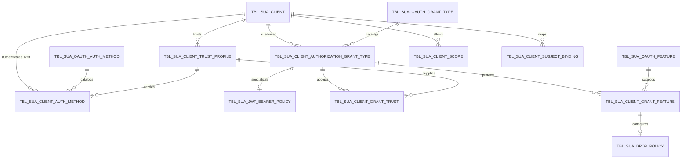

# طراحی مدل قابلیت‌های OAuth Client در `scm-uaa`

## وضعیت و دامنه

| مورد | مقدار |
|---|---|
| وضعیت | طراحی نهایی؛ هنوز پیاده‌سازی نشده است |
| تاریخ | ۱۴۰۵/۰۶/۰۴ - 2026-08-26 |
| دامنه | مدل Client، Grant، Client Authentication، Trust و Token Binding |
| خارج از دامنه | DDL اجرایی، تغییر Entity/Repository، Migration و فعال‌سازی Runtime |

این سند مدل هدف برای `TBL_SUA_CLIENT` و جدول‌های وابسته را مشخص می‌کند. طراحی RFC 7523 فرارفاه در [`FARAREFAH_UAA_DESIGN.md`](FARAREFAH_UAA_DESIGN.md) آمده است.

---

## ۱. تصمیم معماری

سه مفهوم زیر مستقل‌اند و نباید به یکدیگر تبدیل شوند:

| محور | پرسش | نمونه |
|---|---|---|
| Authorization Grant | Client با چه مدرکی برای Token درخواست می‌دهد؟ | `authorization_code`، `client_credentials`، `urn:ietf:params:oauth:grant-type:jwt-bearer` |
| Client Authentication | Client چگونه هویت خودش را در Token Endpoint اثبات می‌کند؟ | `client_secret_basic`، `private_key_jwt` |
| Protocol Feature / Token Binding | Token یا Flow چه ویژگی امنیتی اضافه‌ای دارد؟ | PKCE، DPoP، mTLS |

**DPoP یک Grant Type و یک Client Authentication Method نیست.** طبق RFC 9449، DPoP یک مکانیزم sender-constraining است که می‌تواند همراه Grantهای مختلف و روش‌هایی مانند `private_key_jwt` استفاده شود. همچنین `REQUIRE_PROOF_KEY` فعلی فقط مربوط به PKCE است و نباید برای DPoP بازاستفاده شود.

نتیجه:

- `TBL_SUA_CLIENT` فقط هویت و Policyهای عمومی Client را نگه می‌دارد.
- Grantها، روش‌های احراز Client و Featureها در Assignmentهای مستقل فعال یا غیرفعال می‌شوند.
- افزودن یک Grant یا Feature جدید نباید به ستون جدید Boolean در `TBL_SUA_CLIENT` نیاز داشته باشد.
- وجود رکورد در DB به‌تنهایی قابلیت Runtime ایجاد نمی‌کند؛ Handler امن آن قابلیت نیز باید در نسخه Deploy‌شده موجود باشد.

---

## ۲. وضعیت فعلی سورس و شکاف‌ها

### وضعیت موجود

- Grantهای Client در `TBL_SUA_CLIENT_AUTHORIZATION_GRANT_TYPE` به‌صورت رابطه یک‌به‌چند نگهداری می‌شوند؛ این جهت کلی درست است.
- روش‌های Client Authentication در `TBL_SUA_CLIENT` با Booleanهای مجزا نگهداری می‌شوند.
- Grant Type در Domain به enum محدود است.
- `DynamicRegisteredClientRepository` نگاشت‌های ناشناخته را در بعضی مسیرها با `null` و filter حذف می‌کند.
- `private_key_jwt` هنوز محل استانداردی برای JWKS URI، الگوریتم و lifecycle اعتماد ندارد.
- `requireProofKey` فعلی به تنظیم PKCE در Spring map نشده است.
- Cache تنظیمات Client محلی است و invalidation خوشه‌ای مشخص ندارد.

### ناسازگاری Schema که قبل از Migration باید حل شود

نام PK جدول Grant در فایل‌های فعلی یکسان نیست:

```text
ddl.sql                         CLIENT_AUTHORIZATION_GRANT_TYPE_ID
Entity و seed جدیدتر           CLIENT_AUTH_GRANT_TYPE_ID
```

`ddl.sql` در چند ستون دیگر نیز با Entity فعلی همگام نیست. بنابراین Schema واقعی محیط‌های DB2 باید source of truth ممیزی شود و Migration مستقیماً از `ddl.sql` تولید نشود.

---

## ۳. نمای مفهومی مدل هدف



این مدل Catalog را از Assignment جدا می‌کند:

- Catalog می‌گوید این نسخه UAA چه کدهایی را می‌شناسد و آیا kill switch عمومی آن‌ها باز است.
- Assignment می‌گوید هر Client کدام قابلیت را، در چه بازه‌ای، فعال دارد.
- Policy جزئیات تایپ‌شده همان قابلیت را نگه می‌دارد.

---

## ۴. جدول پایه `TBL_SUA_CLIENT`

جدول Client در مدل نهایی این مسئولیت‌ها را دارد:

| ستون | قاعده |
|---|---|
| `CLIENT_ID` | PK داخلی |
| `CLIENT_IDENTIFIER` | `client_id` canonical، immutable و Unique |
| `TITLE` | عنوان مدیریتی |
| `TERMINAL_CODE` | metadata فعلی کانال در صورت نیاز |
| `STATUS` | وضعیت کلی Client |
| `REQUIRE_AUTH_CONSENT` | Policy عمومی Flowهای تعاملی |
| `CHECK_VERSION` / `CHECK_ACTIVATION` | Policyهای legacy موجود تا زمان بازطراحی |
| `CHECK_IP_ADDRESS` | فعال‌بودن Policy شبکه |
| `ALLOW_IP_ADDRESSES` | در فاز بعد بهتر است به جدول Policy تایپ‌شده منتقل شود |
| `SESSION_TTL_MINUTE` | فقط برای Flowهای session-based فعلی؛ TTL هر Grant در Policy همان Grant قرار می‌گیرد |
| `CONFIG_VERSION` | optimistic locking و invalidation تنظیمات |
| Audit columns | creator/editor و زمان ایجاد/تغییر |

قواعد:

- `client_id` نباید از nickname قابل‌تغییر یک User در زمان اجرا مشتق شود.
- Secret خام، Private Key، JWT، Assertion و Access Token در این جدول ذخیره نمی‌شوند.
- Booleanهای `CLIENT_AUTH_METHOD_*` فقط در دوره Migration باقی می‌مانند و در مدل نهایی حذف می‌شوند.
- `REQUIRE_PROOF_KEY` صرفاً PKCE است؛ در Migration به Policy مربوط به `authorization_code` منتقل می‌شود و نام آن برای DPoP استفاده نمی‌شود.

---

## ۵. کاتالوگ و Assignment مربوط به Grant

### ۵.۱. `TBL_SUA_OAUTH_GRANT_TYPE`

| ستون | قاعده |
|---|---|
| `GRANT_TYPE_CODE` | PK یا Natural Key، `VARCHAR(255)`، exact و case-sensitive |
| `TITLE` | عنوان مدیریتی |
| `STANDARD_REF` | مانند `RFC6749` یا `RFC7523` |
| `RUNTIME_CAPABILITY_CODE` | کلید ثابت برای تطبیق با Registry داخل برنامه، نه نام Java class |
| `STATUS` | kill switch عمومی |
| Audit columns | الزامی |

مقدار RFC 7523 بدون تبدیل به enum name ذخیره می‌شود:

```text
urn:ietf:params:oauth:grant-type:jwt-bearer
```

نام کلاس Handler یا expression اجرایی نباید در DB ذخیره شود. Runtime یک allowlist داخلی از capabilityهای پیاده‌سازی‌شده دارد.

### ۵.۲. توسعه `TBL_SUA_CLIENT_AUTHORIZATION_GRANT_TYPE`

جدول فعلی حفظ و تکمیل می‌شود:

| ستون | قاعده |
|---|---|
| `CLIENT_AUTH_GRANT_TYPE_ID` | PK؛ نام نهایی پس از ممیزی Schema واقعی تثبیت شود |
| `CLIENT_ID` | FK با حذف محدودشده |
| `GRANT_TYPE_CODE` | FK به Catalog |
| `ENABLED` | `0/1`؛ برای داده موجود هنگام backfill برابر `1` |
| `EFFECTIVE_FROM` | شروع اعتبار |
| `EFFECTIVE_TO` | nullable؛ پایان اعتبار |
| `ACCESS_TOKEN_TTL_SEC` | TTL مخصوص همین Client و Grant |
| `REFRESH_TOKEN_ENABLED` | Policy صریح؛ برای RFC 7523 فرارفاه همیشه `0` |
| `REFRESH_TOKEN_TTL_SEC` | فقط در صورت مجاز بودن Refresh |
| `VERSION_NO` | optimistic locking |
| Audit columns | الزامی |

قیود حداقلی:

```text
UNIQUE (CLIENT_ID, GRANT_TYPE_CODE)
CHECK (ENABLED IN (0, 1))
CHECK (REFRESH_TOKEN_ENABLED IN (0, 1))
CHECK (EFFECTIVE_TO IS NULL OR EFFECTIVE_TO > EFFECTIVE_FROM)
CHECK (ACCESS_TOKEN_TTL_SEC > 0)
```

### قانون سه دروازه

یک Grant فقط وقتی قابل استفاده است که هر سه شرط برقرار باشد:

```text
runtime handler deployed
AND grant catalog active
AND client-grant assignment enabled and effective
```

اگر رکوردی فعال باشد اما Handler آن در Runtime وجود نداشته باشد، برنامه باید در validation تنظیمات fail-fast کند؛ حذف بی‌صدای Grant ممنوع است.

---

## ۶. Client Authentication مستقل از Grant

### ۶.۱. `TBL_SUA_OAUTH_AUTH_METHOD`

کدهای اولیه Catalog:

```text
client_secret_basic
client_secret_post
client_secret_jwt
private_key_jwt
none
```

ستون‌ها مانند Catalog Grant شامل `AUTH_METHOD_CODE`، `TITLE`، `STANDARD_REF`، `RUNTIME_CAPABILITY_CODE`، `STATUS` و Audit columns است.

### ۶.۲. `TBL_SUA_CLIENT_AUTH_METHOD`

| ستون | قاعده |
|---|---|
| `CLIENT_AUTH_METHOD_ID` | PK |
| `CLIENT_ID` | FK به Client |
| `AUTH_METHOD_CODE` | FK به Catalog |
| `TRUST_PROFILE_ID` | برای روش‌های asymmetric مانند `private_key_jwt` |
| `ENABLED` | وضعیت Assignment |
| `EFFECTIVE_FROM` / `EFFECTIVE_TO` | lifecycle |
| `VERSION_NO` | optimistic locking |
| Audit columns | الزامی |

قید Unique روی `(CLIENT_ID, AUTH_METHOD_CODE)` برقرار است.

قواعد cross-row که باید در Service و تست DB enforcement شوند:

- `none` با هیچ روش confidential هم‌زمان فعال نمی‌شود.
- `private_key_jwt` بدون Trust Profile فعال و معتبر قابل فعال‌شدن نیست.
- Client فرارفاه Production دقیقاً یک روش فعال، یعنی `private_key_jwt` دارد.
- اگر Basic برای مهاجرت لازم باشد، Client Registration جداگانه ساخته می‌شود؛ روی Client تولیدی fallback پنهان ایجاد نمی‌شود.

### ۶.۳. Secretهای قابل Rotation

در صورت نیاز Clientهای دیگر به روش secret-based، Secret از User جدا و در جدول `TBL_SUA_CLIENT_SECRET` نگهداری می‌شود:

| ستون | توضیح |
|---|---|
| `CLIENT_SECRET_ID` | PK |
| `CLIENT_AUTH_METHOD_ID` | FK به Assignment |
| `SECRET_HASH` | فقط hash/encoded value، نه Secret خام |
| `STATUS` | lifecycle |
| `VALID_FROM` / `VALID_TO` | overlap کنترل‌شده برای Rotation |
| `VERSION_NO` و Audit | الزامی |

مقدار پیش‌فرض مانند `myClientSecret` ممنوع است. Secret خام فقط هنگام provisioning نمایش داده می‌شود و قابل بازیابی از DB نیست.

---

## ۷. Trust Profile و Subject Binding

### ۷.۱. پیکربندی فعلی JWKS در `TBL_SUA_CLIENT`

| ستون | توضیح |
|---|---|
| `JWK_SET_URI VARCHAR(512)` | محل JWKS مورد اعتماد Client؛ در Java از نوع `URI` |
| `TOKEN_AUTH_SIGN_ALG VARCHAR(32)` | الگوریتم امضای مورد قبول و مستقل از محل JWKS |

قواعد:

- Private Key هرگز در SCM ذخیره نمی‌شود.
- ستون دیگری با نام `JWK_SET_URL`، `JWK_URI`، `JWKS_URI` یا `JWKS_URL` ایجاد نمی‌شود.
- `jku` یا `x5u` داخل JWT منبع Trust نیست؛ فقط JWK Set URI ثبت‌شده مدیریتی استفاده می‌شود.
- `http` و `https` از رفتار remote JWKS استاندارد Spring Authorization Server/Nimbus استفاده می‌کنند؛ `file` و `classpath` از Resource abstraction خود Spring خوانده می‌شوند.
- URIهای schemeهای دیگر قابل ذخیره‌اند، اما تا زمانی که Resolver آن scheme را پشتیبانی نکند هنگام resolution صریحاً fail می‌شوند.
- توسعه مدل کامل lifecycle و Trust Profile در صورت نیاز، کار جداگانه است و نباید فیلد فیزیکی JWKS دیگری به Client اضافه کند.

### ۷.۲. `TBL_SUA_CLIENT_GRANT_TRUST`

این رابطه تعیین می‌کند یک Client Grant کدام Trust Profileهای User Assertion را می‌پذیرد:

```text
CLIENT_AUTH_GRANT_TYPE_ID
TRUST_PROFILE_ID
ENABLED
EFFECTIVE_FROM
EFFECTIVE_TO
Audit columns
```

قید Unique روی `(CLIENT_AUTH_GRANT_TYPE_ID, TRUST_PROFILE_ID)` الزامی است و `PURPOSE` Profile باید `SUBJECT_ASSERTION` باشد.

### ۷.۳. `TBL_SUA_CLIENT_SUBJECT_BINDING`

| ستون | توضیح |
|---|---|
| `CLIENT_SUBJECT_BINDING_ID` | PK |
| `CLIENT_ID` | FK |
| `TRUST_PROFILE_ID` | FK به issuer مورد اعتماد |
| `EXTERNAL_SUBJECT` | مقدار opaque و exact-match از `sub` |
| `USER_CHANNEL_AUTHENTICATION_ID` | FK به User داخلی SCM |
| `STATUS` | فعال/غیرفعال |
| effective dates و Audit | lifecycle |

قید Unique روی `(CLIENT_ID, TRUST_PROFILE_ID, EXTERNAL_SUBJECT)` الزامی است. fallback به کد ملی، موبایل، email یا nickname انجام نمی‌شود.

---

## ۸. Policy تایپ‌شده RFC 7523

`TBL_SUA_JWT_BEARER_POLICY` یک extension یک‌به‌یک برای Assignment همان Grant است:

| ستون | مقدار/قاعده فرارفاه |
|---|---|
| `CLIENT_AUTH_GRANT_TYPE_ID` | PK/FK |
| `MAX_ASSERTION_TTL_SEC` | `60` |
| `CLOCK_SKEW_SEC` | `30` |
| `MAX_AUTH_AGE_SEC` | مقدار مصوب Risk/Business |
| `REQUIRED_ACR` | assurance profile مورد توافق |
| `REQUIRED_AMR_POLICY` | Policy تایپ‌شده/نسخه‌بندی‌شده |
| `VERSION_NO` و Audit | الزامی |

این قواعد امنیتی قابل خاموش‌کردن در DB نیستند و در کد ثابت می‌مانند:

- وجود `jti` و Replay Protection؛
- signature و algorithm allowlist؛
- audience دقیق؛
- عدم صدور Refresh Token در Profile فرارفاه؛
- عدم اعتماد مستقیم به role/scope داخل Assertion؛
- عدم پذیرش symmetric algorithm برای Assertion فرارفاه.

---

## ۹. Featureهای مستقل و طراحی DPoP

### ۹.۱. Catalog و Assignment

`TBL_SUA_OAUTH_FEATURE` کاتالوگ Featureهایی مانند `dpop`، `mtls` و `pkce` است. ارتباط یک Feature با یک Grant در `TBL_SUA_CLIENT_GRANT_FEATURE` نگهداری می‌شود:

| ستون | توضیح |
|---|---|
| `CLIENT_GRANT_FEATURE_ID` | PK |
| `CLIENT_AUTH_GRANT_TYPE_ID` | FK به Grant فعال Client |
| `FEATURE_CODE` | برای این سناریو `dpop` |
| `ENABLED` | وضعیت |
| `ENFORCEMENT_MODE` | `OPTIONAL` یا `REQUIRED` |
| effective dates، version و Audit | lifecycle |

قید Unique روی `(CLIENT_AUTH_GRANT_TYPE_ID, FEATURE_CODE)` الزامی است.

PKCE از نظر مدل یک Feature است، اما فقط روی Flowهای تعاملی مناسب معتبر است. Validation باید ترکیب‌های نامعتبر Feature و Grant را رد کند.

### ۹.۲. `TBL_SUA_DPOP_POLICY`

| ستون | توضیح |
|---|---|
| `CLIENT_GRANT_FEATURE_ID` | PK/FK |
| `MAX_PROOF_AGE_SEC` | حداکثر عمر Proof |
| `CLOCK_SKEW_SEC` | skew مجاز |
| `NONCE_MODE` | `DISABLED`، `ON_DEMAND` یا `REQUIRED` مطابق Profile مصوب |
| Audit columns | الزامی |

Allowed asymmetric algorithms در جدول فرزند versioned نگهداری می‌شوند. قواعد ثابت RFC مانند `typ=dpop+jwt`، `htm`، `htu`، `jti`، `ath` و رد private JWK قابل تنظیم نیستند.

DPoP Public Key از Header خود Proof دریافت می‌شود؛ Client JWK ثابت برای آن ثبت نمی‌شود. UAA thumbprint را در Claim استاندارد `cnf.jkt` Access Token bind می‌کند و پاسخ `token_type=DPoP` است.

### ۹.۳. State موقت DPoP

Proof JTI و nonce در جدول تنظیمات ذخیره نمی‌شوند. آن‌ها در Store توزیع‌شده با عملیات atomic و TTL نگهداری می‌شوند:

```text
put-if-absent(namespace, client_id, proof_jti, ttl)
```

Cache محلی برای چند Pod کافی نیست. Resource Server مقصد نیز باید DPoP Proof، `ath`، `htm`، `htu` و تطبیق `cnf.jkt` را اعتبارسنجی کند.

Spring Authorization Server `1.5.3` primitiveهای DPoP را دارد، اما Policy «DPoP الزامی برای این Client/Grant» در `ClientSettings` موجود نیست و Provider سفارشی RFC 7523 باید آن را صریح integrate کند.

---

## ۱۰. پیکربندی منطقی فرارفاه

### فاز اول

```text
Client                         fararefah
Client status                  ACTIVE
Client authentication          private_key_jwt / ACTIVE
Client-auth trust purpose      CLIENT_AUTH
Authorization grant            urn:ietf:params:oauth:grant-type:jwt-bearer
Grant status                   ACTIVE
User-assertion trust purpose   SUBJECT_ASSERTION
Scope                          bank-receipt.generate
Access token TTL               300 seconds
Refresh token                  FORBIDDEN
DPoP                           absent/disabled
```

### فاز بعدی DPoP

Grant و Client Authentication تغییر نمی‌کنند؛ فقط Assignment زیر افزوده می‌شود:

```text
Grant feature                  dpop
Enforcement                    REQUIRED
DPoP policy                    approved proof age / skew / nonce mode
```

به این ترتیب همان Flow RFC 7523، توکن sender-constrained صادر می‌کند و نیازی به Grant جدید یا ستون `ENABLE_DPOP` نیست.

---

## ۱۱. نگاشت Runtime

Repository فقط Assignmentهای فعال، effective و پشتیبانی‌شده را به Spring منتقل می‌کند. کد Grant باید بدون تبدیل case یا enum name حفظ شود:

```java
new AuthorizationGrantType(grantTypeCode)
new ClientAuthenticationMethod(authMethodCode)
```

برای `private_key_jwt`، مدل SCM مقدار `jwkSetUri` از نوع `URI` را نگه می‌دارد. فقط URIهای HTTP/HTTPS در مرز Framework با `toString()` به API استاندارد `ClientSettings.jwkSetUrl(...)` map می‌شوند. signing algorithm مستقل به `ClientSettings` منتقل می‌شود. `requireProofKey` نیز فقط برای PKCE به `ClientSettings.requireProofKey` map می‌شود.

قواعد Runtime:

- Configuration ناقص یا ناشناخته fail-fast می‌شود.
- هیچ Scope عمومی مانند `openid` یا `session` بدون Assignment صریح به همه Clientها اضافه نمی‌شود.
- تغییر هر Assignment در همان Transaction، `CONFIG_VERSION` Client را افزایش می‌دهد.
- Cache Client بین Podها invalidation توزیع‌شده یا TTL کوتاه و revision check دارد.
- collectionهای جدید با EAGER chain بارگذاری نمی‌شوند؛ Aggregate با query کنترل‌شده ساخته می‌شود.

---

## ۱۲. Migration بدون شکستن Clientهای فعلی

1. Schema واقعی همه محیط‌ها با Entity و seedها ممیزی و اختلاف نام ستون‌ها رفع تصمیم شود.
2. Catalogها، جدول Auth Method، Feature و Policyها به‌صورت additive ساخته شوند؛ منبع JWKS در `TBL_SUA_CLIENT.JWK_SET_URI` باقی بماند.
3. ستون‌های `ENABLED`، effective dates و version به جدول Grant فعلی اضافه شوند.
4. Grantهای فعلی در Catalog seed و FK آن‌ها برقرار شود.
5. Booleanهای Auth Method فعلی به Assignmentهای جدید backfill شوند.
6. `CLIENT_IDENTIFIER` canonical از داده معتبر موجود تثبیت شود؛ مشتق‌سازی Runtime از nickname متوقف شود.
7. یک Release با dual-read اجرا شود: وجود Assignment جدید اولویت دارد و در نبود آن legacy Boolean خوانده می‌شود.
8. تغییرات مدیریتی در دوره گذار dual-write و audit شوند.
9. خروجی semantic همه `RegisteredClient`های فعلی در مدل قدیم و جدید مقایسه شود.
10. پس از حداقل یک Release پایدار، خواندن legacy خاموش و سپس ستون‌های Boolean در Migration جدا حذف شوند.

Migration اولیه destructive نیست. Rollback با feature flag خواندن مدل جدید انجام می‌شود و داده Assignment حذف نمی‌شود.

---

## ۱۳. API مدیریتی مورد نیاز

API مدیریت Client باید به‌جای مجموعه Boolean، Aggregate نسخه‌دار دریافت کند:

```json
{
  "clientId": "fararefah",
  "configVersion": 7,
  "authenticationMethods": [
    {"code": "private_key_jwt", "enabled": true, "trustProfileId": 41}
  ],
  "grants": [
    {
      "code": "urn:ietf:params:oauth:grant-type:jwt-bearer",
      "enabled": true,
      "accessTokenTtlSeconds": 300,
      "refreshTokenEnabled": false,
      "features": []
    }
  ],
  "scopes": ["bank-receipt.generate"]
}
```

قواعد مدیریت:

- optimistic locking با `configVersion`؛
- validation کل Aggregate پیش از commit؛
- disable به‌جای delete برای حفظ تاریخچه؛
- Audit مستقل برای فعال/غیرفعال‌کردن Grant، Auth Method، Trust و DPoP؛
- endpointهای مدیریتی role-protected و بدون نمایش Secret/JWKS content خام.

---

## ۱۴. معیار پذیرش طراحی

- فعال یا غیرفعال‌کردن Grant هیچ تغییری در `TBL_SUA_CLIENT` نیاز نداشته باشد.
- افزودن Grant یا Auth Method جدید ستون جدید ایجاد نکند.
- Grant فعال بدون Handler باعث خطای Configuration شود و بی‌صدا حذف نشود.
- Client، Catalog یا Assignment غیرفعال نتیجه `unauthorized_client` بدهد.
- Clientهای موجود قبل و بعد از Migration رفتار semantic یکسان داشته باشند.
- فرارفاه Production فقط `private_key_jwt` فعال داشته باشد.
- Trust Profile مربوط به User Assertion برای Client Assertion و برعکس قابل استفاده نباشد.
- حذف یا غیرفعال‌کردن Assignment تاریخچه Audit را حذف نکند.
- تغییر Configuration در SLA مشخص روی همه Podها دیده شود.
- `none` با روش confidential هم‌زمان فعال نشود.
- RFC 7523 بدون Trust، Policy و Subject Binding کامل فعال نشود.
- DPoP هیچ‌گاه به‌عنوان Grant، Auth Method یا PKCE ذخیره نشود.
- در حالت `REQUIRED`، درخواست بدون DPoP Proof رد شود.
- Replay هم‌زمان Assertion یا DPoP Proof روی چند Pod دقیقاً یک موفقیت داشته باشد.
- هیچ Private Key، Secret خام، Assertion یا Token در DB تنظیمات، Log یا Audit ذخیره نشود.

---

## ۱۵. منابع استاندارد

- [RFC 7523 - JWT Profile for OAuth 2.0 Client Authentication and Authorization Grants](https://www.rfc-editor.org/rfc/rfc7523.html)
- [RFC 9449 - OAuth 2.0 Demonstrating Proof of Possession](https://www.rfc-editor.org/rfc/rfc9449.html)
- [RFC 8705 - OAuth 2.0 Mutual-TLS Client Authentication and Certificate-Bound Access Tokens](https://www.rfc-editor.org/rfc/rfc8705.html)
- [Spring Authorization Server - Extension Grant Guide](https://docs.spring.io/spring-authorization-server/reference/guides/how-to-ext-grant-type.html)
