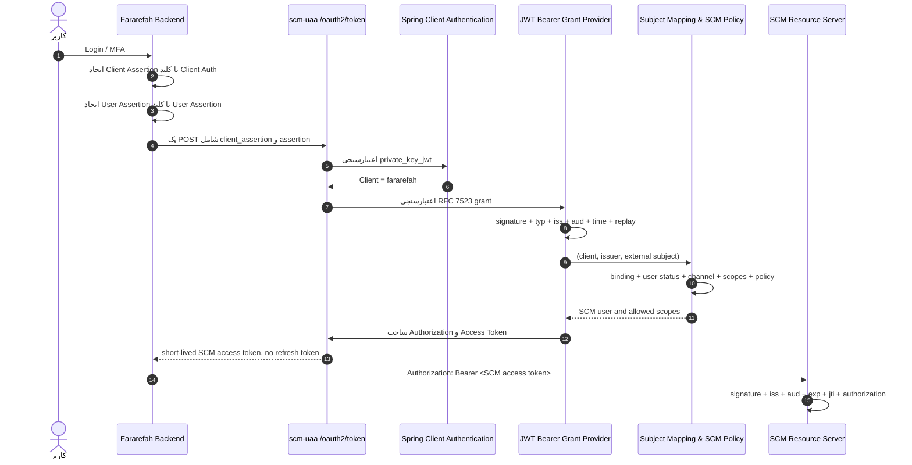

# طراحی نهایی صدور توکن کاربر فرارفاه در `scm-uaa`

## وضعیت سند

| مورد | مقدار |
|---|---|
| وضعیت | تصمیم معماری نهایی برای فاز اول؛ هنوز پیاده‌سازی نشده است |
| تاریخ | ۱۴۰۵/۰۶/۰۴ - 2026-08-26 |
| مبنای سورس | `releases/9.1.0` (`d91f7e696`) |
| مبنای Runtime | Spring Boot `3.5.7` و Spring Authorization Server `1.5.3` |
| دامنه | فقط `scm-uaa` و قرارداد لازم با فرارفاه و Resource Serverهای SCM |

سورس سه ماژول `scm-uaa`، `scm-uaa-common` و `scm-uaa-starter` در شاخه فعلی نسبت به `releases/9.1.0` اختلافی ندارد؛ بنابراین یافته‌های این سند برای Release 9.1.0 معتبر است.

---

## ۱. تصمیم نهایی

کاربر در فرارفاه Authenticate می‌شود و Password، OTP یا Credential کاربر هرگز به SCM منتقل نمی‌شود. فرارفاه در یک درخواست back-channel به `/oauth2/token` دو موضوع مستقل را اثبات می‌کند:

1. **هویت سامانه فرارفاه** با `private_key_jwt`؛
2. **هویت کاربر فرارفاه** با JWT کوتاه‌عمر به‌عنوان Authorization Grant استاندارد RFC 7523.

```text
Client Authentication = private_key_jwt
Authorization Grant   = urn:ietf:params:oauth:grant-type:jwt-bearer
User Evidence         = signed JWT in assertion parameter
Issued Token Subject  = mapped SCM user
Issued Token Actor    = fararefah client
```

بنابراین با `private_key_jwt` در یک HTTP request دو JWT مستقل وجود دارد:

- `client_assertion`: فقط برای اثبات هویت Client؛ `iss` و `sub` آن هر دو `client_id` فرارفاه هستند.
- `assertion`: برای اثبات هویت کاربر؛ `sub` آن شناسه پایدار و غیرقابل‌تغییر کاربر در فرارفاه است.

این تفکیک بخش اصلی قرارداد است. `private_key_jwt` یا `client_secret_basic` به‌تنهایی هیچ هویت کاربری را اثبات نمی‌کنند.

### روش Production و روش گذار

| محیط/کاربرد | Client Authentication | تصمیم |
|---|---|---|
| Production | `private_key_jwt` | روش اصلی و الزامی |
| دوره مهاجرت محدود | `client_secret_basic` | فقط با Client Registration جداگانه و تاریخ انقضا |

روی یک Client تولیدی هر دو روش فعال نمی‌شوند. اگر مهاجرت لازم باشد، Client جداگانه‌ای مانند `fararefah-migration` ساخته می‌شود تا حذف Secret بدون تغییر Client تولیدی و بدون fallback پنهان ممکن باشد.

### تصمیم‌های قطعی دیگر

- Grant نوع `client_credentials` برای این سناریو ممنوع است؛ آن Grant نماینده Client است، نه کاربر.
- ارسال `username`، `nationalCode` یا هر شناسه کاربر کنار `client_credentials` جایگزین User Assertion نیست.
- Access Token حداکثر ۵ دقیقه عمر دارد.
- Refresh Token در فاز اول صادر نمی‌شود.
- نقش‌ها، Scopeها و مجوزهای ارسالی فرارفاه مورد اعتماد مستقیم نیستند؛ SCM آن‌ها را از داده و Policy داخلی خود استخراج می‌کند.
- Client Assertion و User Assertion در Production با دو زوج کلید مجزا امضا می‌شوند.
- هر دو Assertion یک‌بارمصرف هستند و Replay Protection خوشه‌ای دارند.
- `aud` ورودی در پروفایل SCM دقیقاً برابر canonical issuer تنظیم‌شده در `AuthorizationServerSettings` است؛ لیست Audienceهای جایگزین پذیرفته نمی‌شود.

---

## ۲. چرا RFC 7523 و نه Token Exchange؟

مرز تصمیم به نوع مدرک ورودی وابسته است:

| مدرک موجود در فرارفاه | Flow صحیح |
|---|---|
| JWT کوتاه‌عمری که مشخصاً برای گرفتن توکن SCM ساخته می‌شود | RFC 7523 JWT Bearer Authorization Grant؛ تصمیم فاز اول |
| Access Token، ID Token یا User Token مستقلی که فرارفاه قبلاً صادر کرده است | RFC 8693 Token Exchange؛ گزینه تکامل آینده |
| امکان Redirect مرورگر و Federation | Authorization Code + PKCE؛ گزینه تعاملی آینده |

گفت‌وگوی مبنا سناریوی اول را تعریف کرده است: فرارفاه بعد از Authentication کاربر یک Assertion اختصاصی برای SCM می‌سازد. به همین علت RFC 7523 انتخاب نهایی فاز اول است.

Spring Authorization Server از Token Exchange پشتیبانی می‌کند، اما Provider پیش‌فرض نسخه `1.5.3`، `subject_token` را در `OAuth2AuthorizationService` خود جست‌وجو می‌کند. در نتیجه یک JWT خارجی فرارفاه را بدون Provider سفارشی قبول نمی‌کند. تغییر نام ورودی از `assertion` به `subject_token` در این پروژه هزینه سفارشی‌سازی را حذف نمی‌کند.

اگر در آینده فرارفاه یک توکن کاربر مستقل با lifecycle و audience عمومی خود ارائه کرد، قرارداد به RFC 8693 نسخه‌بندی می‌شود؛ RFC 7523 فاز اول بدون Versioning به Token Exchange تغییر نمی‌کند.

---

## ۳. Flow نهایی



### Trust Boundary

SCM فقط این گزاره‌ها را از فرارفاه می‌پذیرد:

- Assertion با کلید عمومی از قبل ثبت‌شده امضا شده است.
- Issuer، Client و نوع Assertion دقیقاً با قرارداد Trust مطابقت دارند.
- کاربر با `sub` مشخص در زمان `auth_time` توسط فرارفاه Authenticate شده است.

SCM این موارد را از Assertion نمی‌پذیرد:

- نقش SCM؛
- Scope نهایی؛
- وضعیت فعال بودن کاربر در SCM؛
- Terminal/Channel مقصد بدون Mapping داخلی؛
- هر Claim هویتی قابل‌تغییر مانند email یا شماره موبایل به‌عنوان کلید Mapping.

---

## ۴. قرارداد HTTP

### ۴.۱. Production با `private_key_jwt`

```http
POST /oauth2/token HTTP/1.1
Host: <canonical-scm-uaa-host>
Content-Type: application/x-www-form-urlencoded

client_id=fararefah
&client_assertion_type=urn:ietf:params:oauth:client-assertion-type:jwt-bearer
&client_assertion=<CLIENT_ASSERTION>
&grant_type=urn:ietf:params:oauth:grant-type:jwt-bearer
&assertion=<USER_ASSERTION>
&scope=<requested-scm-scopes>
```

مقادیر باید مطابق `application/x-www-form-urlencoded` encode شوند. در این درخواست `Authorization: Basic` یا `client_secret` ارسال نمی‌شود.

### ۴.۲. دوره گذار با `client_secret_basic`

```http
POST /oauth2/token HTTP/1.1
Host: <canonical-scm-uaa-host>
Authorization: Basic <base64(form-url-encoded-client-id:form-url-encoded-secret)>
Content-Type: application/x-www-form-urlencoded

grant_type=urn:ietf:params:oauth:grant-type:jwt-bearer
&assertion=<USER_ASSERTION>
&scope=<requested-scm-scopes>
```

User Assertion در هر دو روش یکسان است. فقط روش Authentication خود Client عوض می‌شود. ارسال هم‌زمان بیش از یک روش Client Authentication رد می‌شود.

### ۴.۳. پاسخ موفق

```json
{
  "access_token": "<SCM_ACCESS_TOKEN>",
  "token_type": "Bearer",
  "expires_in": 300,
  "scope": "<granted-scm-scopes>"
}
```

کلید `refresh_token` نباید در پاسخ وجود داشته باشد.

---

## ۵. پروفایل Client Assertion

### Header

```json
{
  "typ": "client-authentication+jwt",
  "alg": "RS256",
  "kid": "fararefah-client-auth-2026-01"
}
```

### Claims

```json
{
  "iss": "fararefah",
  "sub": "fararefah",
  "aud": "https://<canonical-scm-uaa-issuer>",
  "iat": 1787700000,
  "exp": 1787700060,
  "jti": "<cryptographically-random-single-use-id>"
}
```

### قواعد الزامی

- `iss == sub == authenticated client_id`؛
- `aud` دقیقاً یک مقدار و برابر canonical issuer؛
- `alg` فقط مقدار ثبت‌شده `RS256`؛ `none` و algorithm negotiation ممنوع؛
- `kid` باید در JWKS از قبل ثبت‌شده Client وجود داشته باشد؛
- `iat`، `exp` و `jti` اجباری؛
- `exp - iat <= 60 seconds`؛
- Clock skew حداکثر ۳۰ ثانیه؛
- `jti` با عملیات اتمیک در کل Cluster یک‌بارمصرف باشد؛
- Headerهای `jku`، `x5u` و کلید inline از Assertion دنبال یا قبول نشوند؛
- اعتبارسنجی `typ` و Replay به Validator پیش‌فرض Spring اضافه شود.

---

## ۶. پروفایل User Assertion

### Header

```json
{
  "typ": "scm-user-assertion+jwt",
  "alg": "RS256",
  "kid": "fararefah-user-assertion-2026-01"
}
```

### Claims

```json
{
  "iss": "https://<registered-fararefah-identity-issuer>",
  "sub": "<stable-opaque-fararefah-user-id>",
  "aud": "https://<canonical-scm-uaa-issuer>",
  "iat": 1787700000,
  "exp": 1787700060,
  "jti": "<cryptographically-random-single-use-id>",
  "auth_time": 1787699900,
  "sid": "<optional-fararefah-session-id>",
  "acr": "<agreed-assurance-level>",
  "amr": ["pwd", "otp"]
}
```

### قواعد الزامی

- `iss` باید در Trust Configuration همان Client ثبت شده باشد؛
- `sub` باید opaque، پایدار و غیرقابل‌استفاده مجدد برای فرد دیگر باشد؛
- Mapping فقط با `(client_id, iss, sub)` انجام شود؛
- `aud` دقیقاً یک مقدار و برابر canonical issuer؛
- `typ` دقیقاً `scm-user-assertion+jwt`؛
- الگوریتم و `kid` فقط از Trust Configuration انتخاب شوند؛
- `iat`، `exp`، `jti` و `auth_time` اجباری؛
- `acr` و `amr` اجباری و مقادیر آن‌ها باید با assurance profile مورد توافق تطبیق داده شوند؛ `sid` اختیاری است؛
- `exp - iat <= 60 seconds` و Clock skew حداکثر ۳۰ ثانیه؛
- `nbf` در صورت وجود اعتبارسنجی شود؛
- `auth_time` نباید در آینده باشد و باید Policy حداکثر عمر Authentication فرارفاه را پاس کند؛
- `jti` در کل Cluster یک‌بارمصرف باشد؛
- Client Assertion و User Assertion نباید از یک `kid` یا یک key set استفاده کنند؛
- Claimهای غیرقراردادی نادیده گرفته شوند.

`max_auth_age_seconds` تنها مقدار امنیتی است که پیش از Go-live باید با Risk/Business فرارفاه نهایی شود. این مقدار باید در Trust Configuration اجباری باشد و از session lifetime فرارفاه بیشتر نباشد.

---

## ۷. ترتیب دقیق اعتبارسنجی

ترتیب زیر بخشی از رفتار امنیتی است و نباید جابه‌جا یا حذف شود:

1. Parse محدود درخواست و رد پارامتر تکراری یا بیش از حد بزرگ؛
2. Authentication Client توسط زنجیره استاندارد Spring؛
3. کنترل فعال بودن Client و فعال بودن دقیقاً یک Authentication Method؛
4. کنترل فعال بودن Grant `urn:ietf:params:oauth:grant-type:jwt-bearer` برای همان Client؛
5. کنترل IP allowlist، نرخ درخواست و TLS؛
6. Parse محدود User Assertion؛
7. انتخاب Trust Configuration فقط با Client احرازشده و `iss` ثبت‌شده؛
8. کنترل `typ` و allowlist الگوریتم؛
9. پیدا کردن کلید فقط از JWKS ثبت‌شده و کنترل Signature؛
10. کنترل `iss`، `aud`، `iat`، `nbf`، `exp`، `auth_time` و حداکثر TTL؛
11. ثبت اتمیک Replay Key برای `(purpose, client_id, jti)` تا `exp + clockSkew`؛
12. پیدا کردن Subject Binding با `(client_id, iss, sub)`؛
13. کنترل active بودن Binding، User، Person، Client و Channel؛
14. استخراج Permission و Authority فقط از SCM؛
15. محاسبه Scope نهایی؛
16. ساخت و ذخیره `OAuth2Authorization`؛
17. صدور Access Token و ثبت Audit غیرحساس.

Replay store باید عملیات atomic `put-if-absent-with-TTL` داشته باشد. الگوی `get` سپس `put` به‌علت Race Condition قابل قبول نیست. کلیدهای Replay برای Client Assertion و User Assertion namespace جدا دارند.

### Scope نهایی

```text
granted scopes =
    requested scopes
    ∩ registered client scopes
    ∩ SCM user entitlements
    ∩ target resource policy
```

Scope یا Role موجود در User Assertion وارد Access Token نمی‌شود، مگر پس از Mapping صریح و Versioned در SCM.

---

## ۸. مدل داده پیشنهادی

مدل کامل و Migration در [`CLIENT_OAUTH_CAPABILITY_DATA_MODEL_DESIGN.md`](CLIENT_OAUTH_CAPABILITY_DATA_MODEL_DESIGN.md) تعریف شده است. در این Flow ردیف‌های منطقی زیر لازم‌اند:

| بخش | پیکربندی فرارفاه |
|---|---|
| `TBL_SUA_CLIENT` | `client_id=fararefah` و وضعیت فعال؛ بدون Secret/Key/Grant Boolean جدید |
| Client Authentication Assignment | فقط `private_key_jwt` در Production |
| Client-auth Trust Profile | purpose=`CLIENT_AUTH`، JWKS و الگوریتم ثبت‌شده |
| Client Grant Assignment | کد دقیق `urn:ietf:params:oauth:grant-type:jwt-bearer`، فعال، TTL=`300` و Refresh ممنوع |
| User-assertion Trust Profile | purpose=`SUBJECT_ASSERTION`، issuer/JWKS/typ/alg و Policy زمان |
| Grant Trust relation | اتصال Grant فوق به User-assertion Trust Profile |
| Subject Binding | نگاشت exact `(client_id, trust_profile, external_sub)` به User داخلی SCM |
| Scope Assignment | حداقل `bank-receipt.generate` برای سرویس رسید |

Client Authentication، Authorization Grant و Featureهای sender-constraining سه محور جدا هستند. DPoP در آینده به‌عنوان Feature همان Client Grant فعال می‌شود؛ نه Grant جدید است، نه جایگزین `private_key_jwt` و نه همان PKCE/`requireProofKey`.

Private Key فرارفاه در SCM ذخیره نمی‌شود. فقط JWKS/Public Key metadata مربوط به دو Trust Profile مجزا نگهداری می‌شود و استفاده یک key set برای هر دو purpose رد می‌شود.

---

## ۹. قرارداد Access Token خروجی

### Claims اصلی

```json
{
  "iss": "https://<canonical-scm-uaa-issuer>",
  "sub": "<existing-stable-scm-user-subject>",
  "aud": ["<scm-resource-audience>"],
  "client_id": "fararefah",
  "act": { "sub": "fararefah" },
  "scope": ["<granted-scope>"],
  "grant_type": "urn:ietf:params:oauth:grant-type:jwt-bearer",
  "iat": 1787700001,
  "exp": 1787700301,
  "jti": "<scm-access-token-id>"
}
```

- `sub` کاربر داخلی SCM است، نه Subject خام فرارفاه.
- `client_id` و `act.sub` Actor را حفظ می‌کنند تا Delegation در Audit قابل تشخیص باشد.
- `aud` فقط Resource Server مقصد است و نباید برای نگهداری Client ID استفاده شود.
- `typ` در JOSE Header خروجی `at+jwt` باشد.
- Claimهای legacy لازم مانند `trm`، `grn` و `aut` در یک دوره Versioned همراه Claimهای canonical صادر می‌شوند.
- Claimهای حساس مانند Password، challenge code، User Assertion خام، mobile یا national code فقط در صورت قرارداد صریح Resource و تأیید امنیتی مجازند؛ پیش‌فرض این Flow حذف آن‌ها است.

### پیش‌نیاز سازگاری Resource Serverها

کد فعلی `JwtTokenConverter#getClientId` اولین مقدار `aud` را Client ID فرض می‌کند. قرارداد جدید باید ابتدا `client_id` را بخواند و فقط برای توکن‌های legacy به `aud[0]` fallback کند. ترتیب Rollout باید چنین باشد:

1. ابتدا نسخه سازگار `scm-uaa-starter` در همه Resource Serverهای مقصد Deploy شود؛
2. سپس صدور توکن فرارفاه در UAA فعال شود؛
3. پس از حذف همه Consumerهای قدیمی، fallback legacy حذف شود.

همچنین `removeAudienceClaimForPwaToken` در UAA می‌تواند Audience را خالی کند، در حالی که Converter فعلی `aud.get(0)` را بدون کنترل خالی بودن صدا می‌زند. Regression Test این رفتار باید پیش از تغییر قرارداد Claims اضافه شود.

---

## ۱۰. طراحی پیاده‌سازی در Spring Authorization Server

### ۱۰.۱. Client Authentication

برای `private_key_jwt` از Converter و Provider استاندارد Spring استفاده شود، اما Validator آن سخت‌گیرانه‌تر شود:

- نگاشت `Client.jwkSetUri` برای URIهای HTTP/HTTPS به API مرزی `ClientSettings.jwkSetUrl(...)` و نگاشت مستقل signing algorithm در `DynamicRegisteredClientRepository`؛
- سفارشی‌سازی `JwtClientAssertionDecoderFactory` یا Decoder factory متناظر؛
- حفظ validationهای پیش‌فرض Spring و افزودن exact `typ`، issuer-only audience، TTL و Replay؛
- عدم نوشتن Converter/Provider موازی برای کاری که Spring به‌صورت استاندارد انجام می‌دهد.

### ۱۰.۲. JWT Bearer Authorization Grant

Package پیشنهادی:

```text
ir.daneshrefah.scm.uaa.security.oauth2.grant.jwtbearer
├── JwtBearerGrantAuthenticationConverter
├── JwtBearerGrantAuthenticationToken
├── JwtBearerGrantAuthenticationProvider
├── JwtBearerAssertionDecoderFactory
├── TrustedAssertionIssuerService
├── ClientSubjectBindingService
├── AssertionReplayService
└── JwtBearerGrantPolicy
```

Grant با URI دقیق زیر در Runtime capability registry و مدل Domain پشتیبانی شود:

```text
urn:ietf:params:oauth:grant-type:jwt-bearer
```

کد URI نباید به enum name یا case دیگری تبدیل شود. Converter و Provider در `AuthorizationServerSecurityConfig.tokenEndpoint(...)` ثبت می‌شوند. Provider باید Client Principal احرازشده توسط Spring را دریافت کند؛ نباید Client را فقط از `client_id` ورودی دوباره قابل جعل بداند.

هنگام پیاده‌سازی این Grant، Decoder باید پس از احراز Client مقدار `client.getJwkSetUri()` را از پیکربندی SCM بگیرد و آن را به `JwkSetSourceResolver` بدهد. هیچ پارامتر token request و هیچ مقدار `jku`، `x5u`، header یا claim در Assertion مجاز نیست محل JWKS را انتخاب یا override کند. کنترل‌های فعلی `iss`، `sub`، `aud`، `iat`، `exp`، `jti`، signature، replay، client-to-user trust و pin شدن algorithm مستقل از این تغییر باقی می‌مانند.

### ۱۰.۳. Token Generation و Persistence

- برای این Flow شاخه اختصاصی در `OAuth2TokenCustomizer<JwtEncodingContext>` ایجاد شود؛
- شاخه عمومی `AbstractOAuth2GrantAuthenticationToken` بدون اصلاح برای این Flow قابل‌استفاده نیست؛
- `OAuth2Authorization` قبل از پاسخ موفق در `OAuth2AuthorizationService` ذخیره شود؛
- سرویس Authorization در Production باید بین Podها مشترک و پایدار باشد؛ default in-memory قابل قبول نیست؛
- Refresh Token Generator برای این Grant فراخوانی نشود، حتی اگر Client اشتباهاً Grant نوع refresh داشته باشد؛
- ثبت JTI توکن خروجی با semantics جدا از «فقط یک session برای username/terminal» انجام شود تا ورود فرارفاه session مستقل کاربر را بی‌دلیل invalidate نکند.

### ۱۰.۴. Policyهای موجود

`ClientIpPolicy` فعلی ورودی `PreAuthenticationToken` می‌گیرد و صرف فعال بودن native Client Authentication آن را اجرا نمی‌کند. Provider جدید باید IP Policy را با Context واقعی Request صریحاً اجرا کند یا Policy به abstraction مشترک و بدون وابستگی به Token قدیمی refactor شود.

---

## ۱۱. خطاهای Protocol

| وضعیت | OAuth error | قاعده پاسخ |
|---|---|---|
| پارامتر ناقص/تکراری/بیش از حد بزرگ | `invalid_request` | بدون echo کردن Assertion |
| Client Assertion یا Secret نامعتبر | `invalid_client` | بدون اعلام جزئیات کلید یا Client |
| Grant برای Client فعال نیست | `unauthorized_client` | قرارداد استاندارد |
| User Assertion نامعتبر، Replay یا Binding ناموجود | `invalid_grant` | پیام بیرونی یکسان برای جلوگیری از user enumeration |
| Scope خارج از مجاز | `invalid_scope` | Scope مجاز کاربر افشا نشود |
| JWKS ثبت‌شده موقتاً در دسترس نیست و کلید cache نشده | `temporarily_unavailable` | fail closed، جزئیات فقط در Log امن |

Exceptionهای داخلی طبق قرارداد ماژول از SCM error flow عبور می‌کنند و متن آن‌ها نباید JWT، Subject خام، Secret یا URI داخلی حساس را آشکار کند.

---

## ۱۲. Key Management و Rotation

- TLS برای تمام endpointهای remote و JWKS مبتنی بر HTTPS اجباری است؛ اعتبارسنجی certificate و hostname نباید تضعیف شود.
- UAA فقط JWK Set URI ثبت‌شده توسط Administrator را می‌خواند؛ token request، assertion، header و claim اجازه override کردن آن را ندارند.
- منبع `file:` باید فایل کنترل‌شده Server باشد و `classpath:` فقط برای deploymentهای کنترل‌شده استفاده شود.
- ConfigMap در Kubernetes به فایل mount و با `file:` URI معرفی می‌شود؛ scheme اختصاصی `configmap:` وجود ندارد.
- قابل ذخیره بودن یک URI به معنی پشتیبانی Runtime از scheme آن نیست و scheme پشتیبانی‌نشده هنگام resolution صریحاً fail می‌شود.
- مقصد remote از پیکربندی مورد اعتماد می‌آید و رفتار امن TLS و redirect پیاده‌سازی استاندارد Spring/Nimbus حفظ می‌شود.
- Cache کنترل‌شده JWKS با timeout کوتاه، size limit و refresh rate limit لازم است.
- Key rotation با دوره overlap انجام می‌شود: کلید جدید قبل از استفاده Publish، سپس `kid` جدید فعال، و کلید قدیمی بعد از پایان بیشترین TTL حذف می‌شود.
- نبود `kid`، `kid` ناشناخته یا چند کلید مبهم fail closed است.
- Key امضای خود UAA باید از Secret/Keystore مدیریت‌شده Mount شود، `kid` داشته باشد و password پیش‌فرض نداشته باشد.
- `private_key_jwt` فقط Client را در Token Endpoint Authenticate می‌کند و Access Token خروجی همچنان Bearer است. اگر Threat Model به sender-constrained token نیاز دارد، mTLS یا DPoP تصمیم امنیتی جداگانه است؛ این قابلیت را نمی‌توان از `private_key_jwt` استنباط کرد.

---

## ۱۳. Observability و Audit

طبق معماری کل پروژه:

```text
Trace / Log / Audit -> NDJSON -> Filebeat -> Elasticsearch -> Kibana
Metric              -> Actuator -> Micrometer -> Prometheus -> Grafana
```

### Audit مستقل

رویدادهای پیشنهادی:

- `uaa.fararefah.token.issued`
- `uaa.fararefah.token.denied`
- `uaa.fararefah.assertion.replay`
- `uaa.fararefah.key.rotated`
- `uaa.fararefah.binding.changed`

فیلدهای مجاز شامل `client.id`، شناسه داخلی/pseudonymous Binding، `key.kid`، outcome، reason category، correlation id و trace id است.

موارد ممنوع در Trace، Log، Audit و Metric:

- Client Secret یا Private Key؛
- Authorization header؛
- Client Assertion یا User Assertion خام؛
- Access Token؛
- Password، OTP و challenge code؛
- `sub` خارجی در صورت شخصی بودن؛
- national code، mobile، email یا Claimهای هویتی حساس.

### Metric فقط از Micrometer

- تعداد success/failure/replay؛
- latency اعتبارسنجی و token issue؛
- JWKS refresh success/failure؛
- تعداد Binding lookup failure با tag کم‌کاردینالیتی.

هیچ Metric به فایل نوشته نمی‌شود و `sub`، `jti`، `kid` یا Clientهای پویا به‌عنوان tag پرکاردینالیتی استفاده نمی‌شوند.

---

## ۱۴. یافته‌های سورس و شکاف پیاده‌سازی

| وضعیت فعلی | اثر | اقدام لازم |
|---|---|---|
| `PRIVATE_KEY_JWT` در مدل وجود دارد و Client دارای `URI jwkSetUri` و signing algorithm است | Spring فقط remote HTTP(S) JWKS را از API URLمحور خود می‌پذیرد | تطبیق فقط در مرز `ClientSettings` و استفاده از Resolver SCM برای منابع غیر HTTP |
| `DynamicRegisteredClientRepository` authentication method، URIهای HTTP(S) و algorithm مستقل را map می‌کند | رفتار استاندارد remote JWKS حفظ می‌شود | URIهای غیر HTTP به API URLمحور Spring تحمیل نشوند |
| Runtime/Domain فعلی Grant فاقد JWT Bearer است | Client نمی‌تواند Grant استاندارد را فعال کند | افزودن URI دقیق به capability registry، Handler و migration |
| Token Endpoint فقط Grantهای legacy و Shahkar سفارشی را ثبت کرده است | User Assertion مصرف نمی‌شود | Converter/Provider مستقل RFC 7523 |
| User به Client/External Subject Binding مستقیم ندارد | `sub` خارجی امن resolve نمی‌شود | Trust Profile، Grant Trust و Subject Binding |
| شاخه `client_credentials` توکن Client می‌سازد | برای User Token نامناسب است | عدم بازاستفاده |
| Provider عمومی برای Credential خالی `invalid_password` می‌دهد و ممکن است Refresh Token بسازد | semantics نامناسب | Provider اختصاصی بدون refresh |
| شاخه عمومی JWT customizer می‌تواند `loginStaticPassword` را به challenge Claim اضافه کند و type cast خاص دارد | ریسک افشای Credential/خطای Runtime | شاخه اختصاصی allowlist-based |
| JTI فعلی با کلید `username::terminal` فقط یک Token فعال نگه می‌دارد | ممکن است sessionهای دیگر را invalidate کند | semantics جدا برای delegated token |
| Client create در نبود Password مقدار ثابت `myClientSecret` می‌گذارد | Secret قابل حدس | حذف کامل fallback پیش از Go-live |
| endpoint توسعه `get-first-password-token` عمومی است و URL مقصد را از caller می‌گیرد | افشای Credential و ریسک SSRF | حذف یا محدودسازی واقعی با Profile و Role |
| APIهای مدیریت Client TODO مربوط به Role دارند | Trust/JWKS قابل مدیریت بدون مجوز دقیق | role protection و Audit |
| همه Clientها خودکار Scopeهای `openid` و `session` می‌گیرند | نقض least privilege | Scope فقط از config Client |
| Keystore password و alias پیش‌فرض است و Chart mount مخصوص Key ندارد | Key management Production ناقص | Secret volume، rotation و حذف default |
| Authorization store مشترک/persistent تعریف نشده است | رفتار چند Pod و revocation ناپایدار | shared implementation |
| `scm-uaa/src/test` وجود ندارد | تغییر امنیتی بدون safety net | Unit، integration و concurrency tests |
| `aud` خالی PWA با `aud.get(0)` در Consumer ناسازگار است | regression موجود در Claim parsing | تست و اصلاح پیش از rollout |

فایل‌های اصلی مرتبط:

- [`AuthorizationServerSecurityConfig.java`](src/main/java/ir/daneshrefah/scm/uaa/config/AuthorizationServerSecurityConfig.java)
- [`DynamicRegisteredClientRepository.java`](src/main/java/ir/daneshrefah/scm/uaa/config/DynamicRegisteredClientRepository.java)
- [`JWTConfig.java`](src/main/java/ir/daneshrefah/scm/uaa/config/JWTConfig.java)
- [`ClientEntity.java`](src/main/java/ir/daneshrefah/scm/uaa/repository/authentication/client/entity/ClientEntity.java)
- [`ClientService.java`](src/main/java/ir/daneshrefah/scm/uaa/service/client/ClientService.java)
- [`AccessTokenController.java`](src/main/java/ir/daneshrefah/scm/uaa/controller/token/AccessTokenController.java)
- [`ClientController.java`](src/main/java/ir/daneshrefah/scm/uaa/controller/client/ClientController.java)
- [`OAuth2TokenGrantAuthenticationProvider.java`](src/main/java/ir/daneshrefah/scm/uaa/security/oauth2/grant/OAuth2TokenGrantAuthenticationProvider.java)

---

## ۱۵. تست‌های پذیرش اجباری

### Happy path

- `private_key_jwt` معتبر + User Assertion معتبر + Binding فعال؛
- `client_secret_basic` فقط روی Client مهاجرت؛
- Scope خروجی دقیقاً intersection مورد انتظار؛
- Access Token پنج‌دقیقه‌ای، Actor مشخص و بدون Refresh Token؛
- Resource Server کاربر و Client را به‌درستی استخراج کند.

### Client Authentication

- `iss` یا `sub` متفاوت از Client ID؛
- `aud` اشتباه یا چندمقداری؛
- `alg=none`، الگوریتم غیرمجاز و algorithm confusion؛
- `kid` ناشناخته، کلید قدیمی و Signature غلط؛
- `typ` غلط؛
- TTL بیش از ۶۰ ثانیه، `iat` آینده و Assertion منقضی؛
- Replay هم‌زمان روی دو Pod: دقیقاً یک درخواست موفق؛
- ارسال هم‌زمان Basic و Client Assertion؛
- تلاش Client مهاجرت برای استفاده از `private_key_jwt` و برعکس.

### User Assertion

- استفاده از کلید Client Auth برای امضای User Assertion و برعکس؛
- `iss`، `aud`، `typ` یا Signature اشتباه؛
- `sub` ناشناخته، Binding غیرفعال یا تکراری؛
- User، Person، Channel یا Client غیرفعال؛
- `auth_time` آینده یا قدیمی‌تر از Policy؛
- Replay سریالی و هم‌زمان؛
- Claim نقش/Scope جعلی در Assertion؛
- Assertion بسیار بزرگ، پارامتر تکراری یا malformed JWT؛
- JWKS timeout، response بزرگ، redirect غیرمجاز و host غیرمجاز.

### Token و سازگاری

- نبود هرگونه Password، Assertion و PII غیرمجاز در Token/Log/Audit؛
- `client_id` و `act.sub` صحیح؛
- `aud` فقط Resource مقصد؛
- Claimهای legacy و canonical در دوره migration؛
- PWA با Audience خالی باعث exception نشود؛
- توکن فرارفاه session فعال دیگری از همان کاربر را invalidate نکند؛
- Token منقضی، JTI نامعتبر و Audience اشتباه در Resource Server رد شود؛
- Key rotation در دوره overlap بدون downtime و پس از آن با رد کلید قدیمی.

---

## ۱۶. ترتیب پیاده‌سازی و Rollout

### مرحله ۰ - رفع Blockerهای امنیتی

1. حذف `myClientSecret`؛
2. حذف/محدودسازی endpoint عمومی توسعه؛
3. Role protection و Audit برای Client/Trust management؛
4. آماده‌سازی Keystore/Secret/TLS/canonical issuer؛
5. اصلاح Claim parser و تست Audience خالی.

### مرحله ۱ - سازگاری Consumer

1. افزودن `client_id` و Claim parsing جدید به `scm-uaa-starter`؛
2. Deploy در تمام Resource Serverهای مقصد؛
3. تست قرارداد Claims و JTI بدون فعال کردن فرارفاه.

### مرحله ۲ - مدل داده و Client Authentication

1. افزودن `JWK_SET_URI VARCHAR(512)` و حفظ `TOKEN_AUTH_SIGN_ALG VARCHAR(32)` در Client؛ Migrationهای Trust Issuer و Subject Binding در task مستقل؛
2. تکمیل DTO/Mapper/Repository؛
3. فعال‌سازی native `private_key_jwt` با Validator سخت‌گیرانه؛
4. تست Rotation و Replay خوشه‌ای.

### مرحله ۳ - RFC 7523 Grant

1. Converter/Provider/Policy اختصاصی؛
2. Scope intersection، Authorization persistence و Token customizer؛
3. Unit، integration، negative و concurrency tests؛
4. تست end-to-end با کلیدهای غیرتولیدی فرارفاه.

### مرحله ۴ - Pilot و Production

1. Client مهاجرت فقط در صورت نیاز و با expiry؛
2. Pilot با allowlist محدود و Dashboard؛
3. فعال‌سازی `fararefah` با `private_key_jwt`؛
4. حذف Client مهاجرت و Secret؛
5. Rotation تمرینی و تأیید Runbook rollback.

Rollback با disable کردن Grant/Trust Configuration انجام می‌شود؛ نباید کل UAA یا Flowهای legacy را متوقف کند.

---

## ۱۷. معیار Go-live

Go-live فقط وقتی مجاز است که همه موارد زیر برقرار باشند:

- همه Blockerهای بخش ۱۴ بسته شده‌اند؛
- قرارداد `iss`، canonical `aud`، `sub`، `acr/amr` و `max_auth_age_seconds` توسط دو طرف امضا شده است؛
- Public Keyها، Rotation و تماس عملیاتی دو طرف ثبت شده‌اند؛
- Replay test هم‌زمان در چند Pod فقط یک success دارد؛
- هیچ Refresh Token صادر نمی‌شود؛
- Resource Serverها `client_id` و Audience جدید را درست validate می‌کنند؛
- Penetration test شامل SSRF، JWT confusion، replay، scope escalation و user enumeration پاس شده است؛
- Log/Trace/Audit/Metric فاقد Secret، Token، Assertion و PII ممنوع است؛
- Audit مستقل، Dashboard و Alertهای failure/replay فعال‌اند؛
- Runbook قطع Trust، تعویض Key و rollback آزمایش شده است.

---

## ۱۸. منابع استاندارد

- [RFC 7523 - JWT Profile for OAuth 2.0 Client Authentication and Authorization Grants](https://www.rfc-editor.org/rfc/rfc7523.html)
- [RFC 8725 - JWT Best Current Practices](https://www.rfc-editor.org/rfc/rfc8725.html)
- [RFC 9700 - OAuth 2.0 Security Best Current Practice](https://www.rfc-editor.org/rfc/rfc9700.html)
- [RFC 8693 - OAuth 2.0 Token Exchange](https://www.rfc-editor.org/rfc/rfc8693.html)
- [RFC 9068 - JWT Profile for OAuth 2.0 Access Tokens](https://www.rfc-editor.org/rfc/rfc9068.html)
- [Spring Authorization Server - Supported Features](https://docs.spring.io/spring-authorization-server/reference/overview.html)
- [Spring Authorization Server - Extension Grant Guide](https://docs.spring.io/spring-authorization-server/reference/guides/how-to-ext-grant-type.html)
