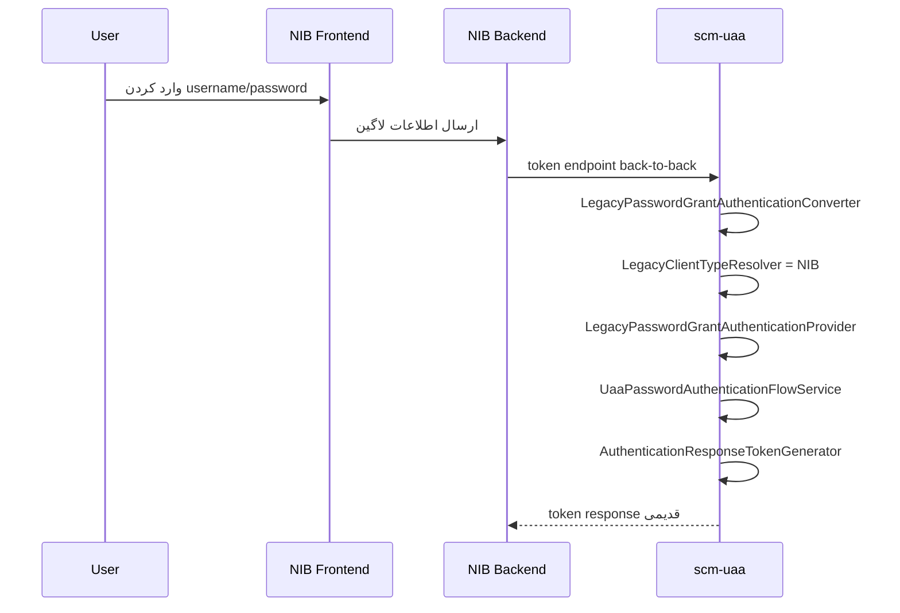
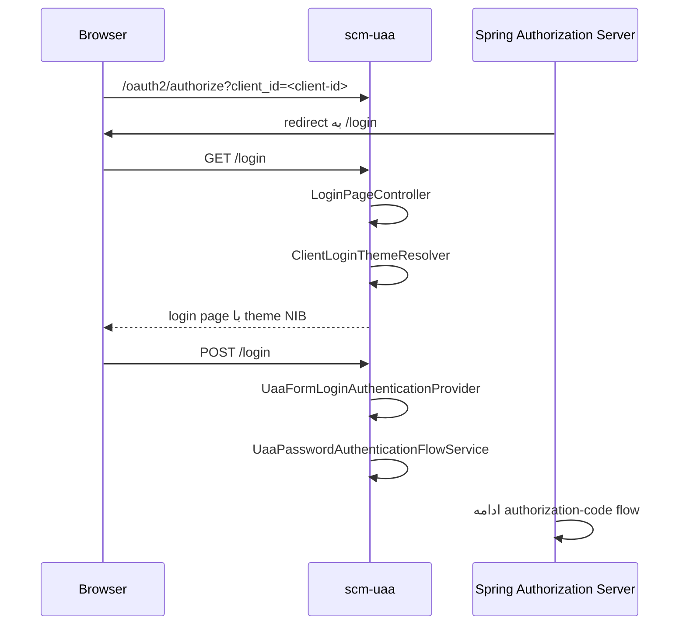
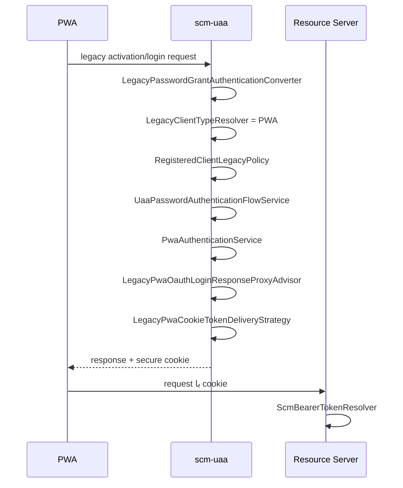
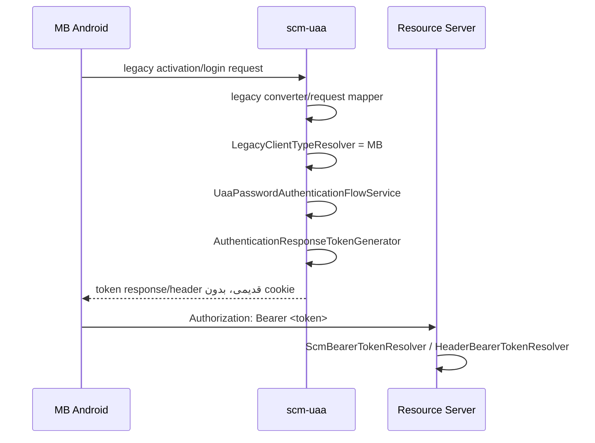
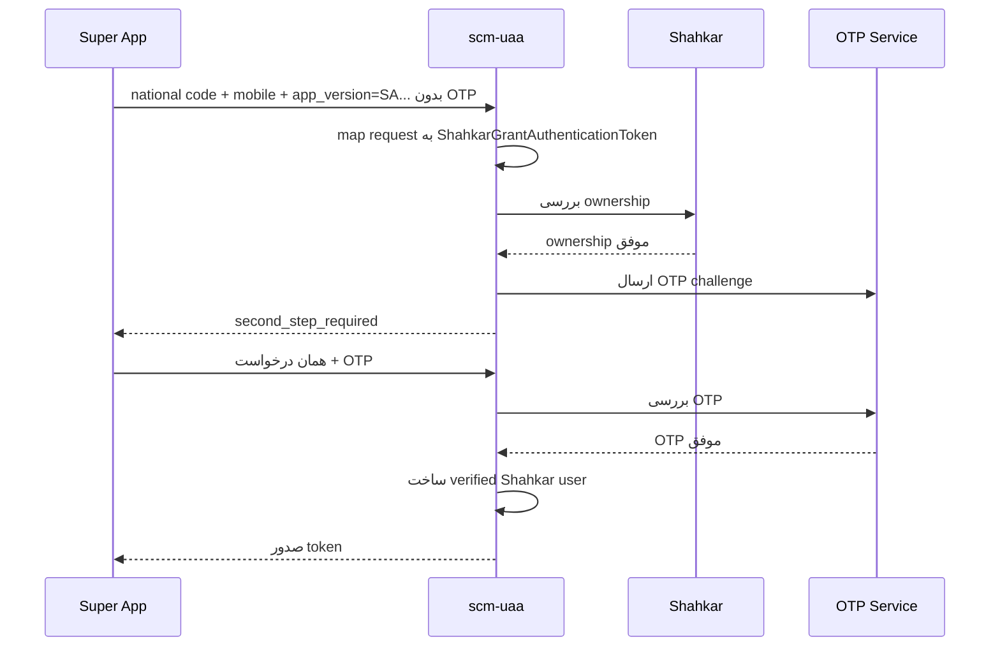

# راهنمای Authentication در `scm-uaa`

## Runtime configuration

- `application.yml` contains shared defaults and is the no-profile local fallback. `application-dev.yml` is the local developer template; neither connects to `scm-config`.
- `application-test.yml`, `application-pilot.yml`, and `application-prod.yml` are Kubernetes profiles and import `scm-config`. Database credentials and allowed CORS origins must come from config server or environment variables.
- UAA has one required `mainDataSource` and one optional legacy `activationDataSource`. Disabling `scm.uaa.datasource.activation.enabled` removes the legacy MB/PWA activation repositories, services, controllers, and adapters without disabling normal login or token handling. The activation datasource will be deprecated after legacy migration.
- UAA security explicitly selects `uaaCorsConfigurationSource`; it does not use `@Primary` to resolve CORS beans. Credentialed CORS rejects a wildcard, and the Kubernetes profiles also reject an empty origin list.
- The dev profile supports HTTPS through `SCM_UAA_SSL_*`. Realistic cross-site cookie tests normally require `SameSite=None; Secure`; `Secure` requires HTTPS except for browser localhost exceptions. A `__Host-` cookie also requires `Path=/` and no `Domain` attribute.
- Log, trace, and audit use separate NDJSON files. Dev and the no-profile local fallback also log to the console. Test, pilot, and prod default to files under `/var/log/app`.

هدف این است که بدانید هر مسیر لاگین از کجا وارد می‌شود، کدام کلاس‌ها مسئول چه کاری هستند، کجا باید کد اضافه کنید، و چطور خروجی‌های JSONL برای LOG و TRACE تولید می‌شوند.

## ۱. لاگین قدیمی NIB - صفحه لاگین در فرانت NIB و دریافت توکن به صورت back-to-back

در این مسیر کاربر `username` و `password` را در فرانت NIB وارد می‌کند. سپس بک‌اند NIB به صورت back-to-back به token endpoint در `scm-uaa` درخواست می‌زند. این مسیر legacy و deprecated است و فقط برای سازگاری نگه داشته شده است. جایگزین هدف، UAA-hosted login و authorization-code flow است.

در این مسیر PWA cookie ساخته نمی‌شود. توکن از همان response قدیمی token endpoint برمی‌گردد.

جریان کلاس‌ها:

- درخواست token endpoint وارد `AuthorizationServerSecurityConfig` می‌شود.
- `LegacyPasswordGrantAuthenticationConverter` درخواست HTTP را به `LegacyPasswordGrantAuthenticationToken` تبدیل می‌کند.
- نرمال‌سازی و map کردن پارامترها در کلاس‌های `LegacyPasswordGrantRequestMapper` و `LegacyDefaultGrantRequestMapper` انجام می‌شود.
- `LegacyClientTypeResolver` نوع کلاینت را با اتکا به `client_id` یا تنظیمات کلاینت، و نه فقط request hint، به NIB تشخیص می‌دهد.
- `LegacyPasswordGrantAuthenticationProvider` فقط adapter مربوط به Spring Authorization Server است.
- `UaaPasswordAuthenticationFlowService` سیاست‌های کلاینت، IP، نسخه، activation، load شدن user، و روش password/OTP را هماهنگ می‌کند.
- `AuthenticationResponseTokenGenerator` پاسخ OAuth2 token را می‌سازد.
- `LegacyPwaOauthLoginResponseProxyAdvisor` شکل response قدیمی را نگه می‌دارد، اما برای NIB cookie نمی‌سازد.
- `UaaObservation` و observation starter خروجی‌های JSONL برای LOG و TRACE تولید می‌کنند.

TRACE/LOG مهم:

- root HTTP span توسط filter در `scm-observation-starter` ساخته می‌شود.
- spanهای داخلی می‌توانند نام‌هایی مثل `uaa.legacy.nib.login` و `uaa.token.issue` داشته باشند.
- JSONL نباید شامل password، JWT خام، Authorization header، mobile خام، national code خام، OTP یا cookie value باشد.

## ۲. لاگین جدید NIB - صفحه لاگین داخل scm-uaa

در مسیر جدید، کاربر از NIB به authorization endpoint در UAA redirect می‌شود. سپس UAA صفحه لاگین را با theme/design مخصوص NIB نمایش می‌دهد. کاربر username/password را مستقیم داخل UAA وارد می‌کند، بنابراین بک‌اند NIB password کاربر را دریافت نمی‌کند.

این مسیر architecture هدف است و باید با Spring Authorization Server authorization-code flow سازگار بماند. این مسیر هیچ dependency به packageهای legacy ندارد.

جریان کلاس‌ها:

- مرورگر به `/oauth2/authorize` می‌زند.
- Spring Authorization Server کاربر را به `/login` هدایت می‌کند.
- `LoginPageController` صفحه لاگین را render می‌کند.
- `ClientLoginThemeResolver` theme مربوط به NIB را از `client_id` یا config تشخیص می‌دهد.
- `UaaFormLoginAuthenticationProvider` فقط integration مربوط به Spring form login است.
- `UaaPasswordAuthenticationFlowService` احراز هویت user/password را انجام می‌دهد.
- پس از موفقیت، Spring Authorization Server authorization-code flow را ادامه می‌دهد.
- token بعدا از مسیر استاندارد token endpoint صادر می‌شود.

TRACE/LOG مهم:

- رویدادها و spanهای اصلی: `uaa.login.page`، `uaa.login.submit`، `uaa.token.issue`
- فیلدهای JSONL باید شامل مواردی مثل `flow.name`، `auth.flow`، `client.id`، `event.outcome`، `status.code`، `correlation.id` و `trace.id` باشند.
- مقدارهای حساس باید mask یا حذف شوند.

## ۳. لاگین و activation در PWA - توکن و کد activation از طریق cookie

PWA هنوز از legacy activation/login flow استفاده می‌کند. PWA و MB Android business flow مشترک دارند؛ تفاوت فقط در token delivery است. PWA برای سازگاری قدیمی JWT را از طریق secure cookie دریافت می‌کند.

این cookie legacy و deprecated است. cookie فقط وقتی ساخته می‌شود که تنظیمات کلاینت و policy اجازه بدهند. request hint به تنهایی اجازه ساخت cookie نمی‌دهد. هدف آینده، authorization-code flow یا opaque server-side session است.

جریان کلاس‌ها:

- درخواست وارد token endpoint یا legacy activation/login endpoint می‌شود.
- `LegacyPasswordGrantAuthenticationConverter` و mapperهای آن پارامترها و headerهای قدیمی را می‌خوانند.
- `LegacyClientTypeResolver` نوع کلاینت را بر اساس client config یا `client_id` به PWA تشخیص می‌دهد؛ request hint فقط کمک سازگاری است.
- `RegisteredClientLegacyPolicy` و `LegacyCookiePolicy` تصمیم می‌گیرند آیا PWA cookie مجاز است یا نه.
- `UaaPasswordAuthenticationFlowService` checkهای activation/login را هماهنگ می‌کند.
- `PwaAuthenticationService` compatibility مخصوص PWA را قبل/بعد از authentication انجام می‌دهد.
- `LegacyPwaOauthLoginResponseProxyAdvisor` response body قدیمی را نگه می‌دارد.
- `LegacyPwaCookieTokenDeliveryStrategy` تنها کلاس مجاز برای ساخت cookie توکن legacy است.
- resource serverهایی مثل `scm-web` از `scm-uaa-starter` استفاده می‌کنند.
- `ScmBearerTokenResolver` وقتی cookie support فعال باشد، توکن را از cookie می‌خواند.
- Authorization header همچنان default است مگر اینکه config چیز دیگری بگوید.

قانون‌های cookie:

- نام cookie قابل تنظیم است.
- cookie باید `HttpOnly` باشد.
- در production باید `Secure` باشد.
- `SameSite`، `Path` و `Max-Age` از config می‌آیند.
- cookie نباید password، OTP، activation code خام یا state نامرتبط داشته باشد.
- اگر JWT در cookie نگه داشته شده، فقط برای legacy compatibility است.

TRACE/LOG مهم:

- span/eventهای اصلی: `uaa.legacy.pwa.activation`، `uaa.legacy.pwa.login`، `uaa.legacy.token.delivery`، `uaa.cookie.create`، `uaa.token.issue`
- JSONL نباید JWT خام، cookie value، password، OTP، mobile خام یا national code خام داشته باشد.

## ۴. لاگین و activation در MB Android - توکن و کد activation از طریق header

MB Android همان business flow قدیمی PWA را استفاده می‌کند. تفاوت فقط token delivery است. MB هرگز نباید cookie دریافت کند. رفتار backward-compatible فعلی با `Authorization: Bearer ...` و token response/header باید حفظ شود.

PWA cookie strategy نباید برای MB انتخاب شود. request hint هم نباید MB را مجبور به گرفتن cookie کند.

جریان کلاس‌ها:

- درخواست وارد token endpoint یا legacy activation/login endpoint می‌شود.
- converter و request mapper قدیمی headerها/پارامترهای MB را می‌خوانند.
- `LegacyClientTypeResolver` با `client_id` یا config نوع کلاینت را MB تشخیص می‌دهد؛ app version فقط hint سازگاری است.
- `UaaPasswordAuthenticationFlowService` client check، activation policy، user loading و روش password/OTP را انجام می‌دهد.
- token از مسیر response/header قدیمی برمی‌گردد.
- هیچ token delivery strategy برای MB اجرا نمی‌شود.
- resource serverها توکن MB را از Authorization header با `ScmBearerTokenResolver` و `HeaderBearerTokenResolver` اعتبارسنجی می‌کنند.

TRACE/LOG مهم:

- span/eventهای اصلی: `uaa.legacy.mb.activation`، `uaa.legacy.mb.login`، `uaa.token.issue`
- وقتی مرتبط است، attributeای مثل `cookie.created=false` باید قابل مشاهده باشد.
- برای MB نباید `Set-Cookie` ساخته شود.
- هیچ مقدار خام حساس نباید وارد JSONL شود.

## Legacy app_version و انتخاب client_id

کلاینت‌های قدیمی PWA، اپلیکیشن MB و Super App ممکن است نسخه برنامه را با نام‌های متفاوتی در header بفرستند. UAA این aliasها را مستقیما در کد تشخیص می‌دهد:

- `AppVersion`
- `Appversion`
- `app_version`
- `app-version`
- `APP_VERSION`
- `APPVERSION`

نام این aliasها قابل تنظیم نیست. فقط `client_id` نهایی قابل تنظیم است:

- `scm.uaa.legacy.client-resolution.pwa-client-id`
- `scm.uaa.legacy.client-resolution.mb-client-id`
- `scm.uaa.legacy.client-resolution.super-app-client-id`
- `scm.uaa.legacy.client-resolution.nib-client-id`

در grant قدیمی `default`، اگر نسخه با `PWA` شروع شود به `client_id` تنظیم‌شده PWA، اگر با `MB` شروع شود به `client_id` تنظیم‌شده MB، و اگر با `SA` شروع شود به `client_id` تنظیم‌شده Super App نگاشت می‌شود. مقدارهای پیش‌فرض سازگار با رفتار قدیمی به‌ترتیب `PWA`، `MB` و `SA` هستند.

این نگاشت فقط برای سازگاری مسیر legacy/default است. کلاینت‌های استاندارد OAuth2 باید `client_id` عادی خود را ارسال کنند. مقدار `app_version` فقط یک compatibility hint است و اختیار امنیتی ایجاد نمی‌کند؛ policy ثبت‌شده کلاینت منبع نهایی تصمیم است.

نسخه ناشناخته مثل `WEB-1.0.0` با خطای `invalid_app_version` رد می‌شود. نسخه ناشناخته هرگز به PWA تبدیل نمی‌شود. اگر principal احراز هویت‌شده OAuth2 و پارامتر صریح `client_id` وجود نداشته باشد، نبودن `app_version` با `invalid_client` رد می‌شود و آن هم نباید به‌صورت ضمنی PWA انتخاب شود.

## لاگین دو مرحله‌ای PWA/MB از smsotp استفاده نمی‌کند

package قدیمی `security.oauth2.grant.smsotp` حذف شده و نباید دوباره ساخته شود. لاگین username/password همراه با SMS OTP یا device OTP برای PWA و MB همچنان از grant قدیمی password/default استفاده می‌کند و یک OAuth2 grant جدا به نام SMS OTP ندارد.

- در درخواست اول، username و password ارسال می‌شود. اگر روش لاگین کاربر به مرحله دوم نیاز داشته باشد، پاسخ نشان می‌دهد که authentication هنوز کامل نشده است و OTP ارسال می‌شود.
- در درخواست دوم، کد OTP ارسال می‌شود. در DEFAULT grant مربوط به PWA/MB، کد از header قدیمی مثل `x-otp-code` خوانده و به `claimCode` تبدیل می‌شود.
- ارسال و بررسی SMS/device OTP در login authentication method tokenها و `LoginAuthenticationMethodProvider` انجام می‌شود.
- این جریان با Shahkar جدا است و نباید به package یا grant مربوط به Shahkar منتقل شود.

## Login Authentication Method Tokens

نام‌های قدیمی `FirstLvl*` حذف شده‌اند، چون این کلاس‌ها level عمومی امنیتی نیستند و فقط روش‌های مختلف لاگین را نمایش می‌دهند. نام‌های فعلی عبارت‌اند از:

- `StaticPasswordLoginAuthenticationToken`
- `PinLoginAuthenticationToken`
- `PatternLoginAuthenticationToken`
- `SmsOtpRequestLoginAuthenticationToken`
- `SmsOtpVerifyLoginAuthenticationToken`
- `DeviceOtpRequestLoginAuthenticationToken`
- `DeviceOtpVerifyLoginAuthenticationToken`

این tokenها مشخص می‌کنند که لاگین کامل شده یا به مرحله دیگری نیاز دارد. `SmsOtpRequestLoginAuthenticationToken` درخواست ارسال SMS OTP را ایجاد می‌کند، `SmsOtpVerifyLoginAuthenticationToken` کد SMS را بررسی می‌کند و `DeviceOtpVerifyLoginAuthenticationToken` کد device OTP را بررسی می‌کند. در مسیر سازگاری PWA/MB ممکن است DEFAULT grant داخل سیستم مانند `FIRST_PASSWORD` پردازش شود، اما نام کلاس‌ها و مسئولیت آنها login-specific باقی می‌ماند.

## لاگین Shahkar برای Super App

Shahkar فقط مسیر لاگین Super App است. Super App باید `app_version` یا `AppVersion` با مقداری که با `SA` شروع می‌شود بفرستد تا client سازگار Super App resolve شود. PWA، MB و NIB مجاز به استفاده از Shahkar grant نیستند. `app_version` به‌تنهایی اختیار امنیتی ایجاد نمی‌کند و policy مربوط به registered client باید نوع Super App را تایید کند.

در این جریان ابتدا مالکیت شماره موبایل و کد ملی در Shahkar بررسی می‌شود. فقط پس از موفقیت ownership check، OTP ارسال می‌شود. در درخواست دوم OTP بررسی می‌شود و فقط پس از موفقیت آن، کاربر نهایی Shahkar با `createShahkarVerifiedUserAndDeleteOld` ساخته می‌شود. قبل از OTP موفق هیچ verified user نهایی و هیچ access token نهایی ساخته نمی‌شود.

منطق request parsing در mapper، منطق ownership/OTP/user creation در flow service و منطق refresh/session cache در session service قرار دارد. converter فقط HTTP request را به `ShahkarGrantAuthenticationToken` تبدیل می‌کند.

## قانون طلایی امنیتی

هیچ‌وقت این مقدارها را log، trace یا داخل error message ننویسید:

- password
- OTP
- JWT خام
- cookie value
- Authorization header
- mobile number خام
- national code خام
- username خام اگر در context حساس است

اگر لازم بود شناسه‌ای برای troubleshooting داشته باشید، آن را mask کنید. برای مثال فقط prefix/suffix کوتاه را نگه دارید و بقیه را با `***` جایگزین کنید.

## LOG و TRACE چگونه JSONL می‌شوند؟

`scm-uaa` از `scm-observation-starter` استفاده می‌کند. هر inbound HTTP request یک root trace span دارد. کلاس‌های authentication و security برای operationهای داخلی child/application span یا structured event تولید می‌کنند.

خروجی LOG و TRACE به صورت JSONL است: هر خط دقیقا یک JSON object فشرده است. pretty print، JSON array و multiline stack trace در فایل‌ها مجاز نیست. Filebeat، Kafka یا Logstash می‌توانند این فایل‌های JSONL را line by line مصرف کنند.

توسعه‌دهنده‌ها نباید writer دستی مثل `FileWriter`، `BufferedWriter` یا `ObjectMapper` line writer بسازند. برای log/trace از abstractionهای موجود مثل `UaaObservation` و زیرساخت observation استفاده کنید.

## کجا کد اضافه کنیم؟

- تغییرات UI لاگین استاندارد UAA: `ir.daneshrefah.scm.uaa.web.login`
- تغییرات legacy token endpoint برای NIB/PWA/MB: `ir.daneshrefah.scm.uaa.security.oauth2.grant.legacy.*`
- تغییرات PWA cookie delivery: `ir.daneshrefah.scm.uaa.security.oauth2.grant.legacy.delivery`
- تغییرات response body قدیمی: `ir.daneshrefah.scm.uaa.security.oauth2.grant.legacy.response`
- تغییرات client policy: `ir.daneshrefah.scm.uaa.security.oauth2.policy`
- parsing درخواست Shahkar: `ir.daneshrefah.scm.uaa.security.oauth2.grant.shahkar.converter`
- business flow مربوط به Shahkar: `ir.daneshrefah.scm.uaa.security.oauth2.grant.shahkar.flow`
- refresh/session cache مربوط به Shahkar: `ir.daneshrefah.scm.uaa.security.oauth2.grant.shahkar.session`
- tokenهای روش لاگین: `ir.daneshrefah.scm.uaa.security.authentication.method.token`
- ساخت request/response token در OAuth2: `ir.daneshrefah.scm.uaa.security.oauth2.token`
- encoder سازگاری password قدیمی: `ir.daneshrefah.scm.uaa.security.password`
- تغییرات استخراج token در resource serverها: `scm-uaa-starter/.../resource`

`LegacyPassword` مقدار خام password را در `toString()` نمایش نمی‌دهد و `LegacyUsernameSaltedMd5PasswordEncoder` فقط برای رکوردهای قدیمی نگه داشته شده و deprecated for removal است. حذف این دو کلاس فقط بعد از migration کامل password storage مجاز است.

## کجا کد اضافه نکنیم؟

- package قدیمی `security.authenticationProvider` را دوباره نسازید.
- empty marker service اضافه نکنید.
- no-op strategy اضافه نکنید.
- legacy response code را داخل package عمومی `service.proxy` نگذارید.
- cookie creation را داخل authentication provider نگذارید.
- business logic را داخل converter نگذارید.
- package حذف‌شده `security.oauth2.grant.smsotp` را دوباره نسازید.
- از نام‌گذاری `FirstLvl` استفاده نکنید.
- token مربوط به Shahkar را داخل `security.token` قرار ندهید؛ این package حذف شده است.
- ownership check یا ارسال OTP مربوط به Shahkar را داخل converter انجام ندهید.
- قبل از موفقیت OTP، verified Shahkar user نسازید.
- تا پایان migration ذخیره passwordهای قدیمی، package فعال `security.password` را حذف نکنید. providerها باید از `PasswordEncoder.matches(...)` استفاده کنند و نباید MD5 را دستی مقایسه کنند.
- password خام، OTP، JWT، cookie، Authorization header، شماره موبایل یا کد ملی را به log، trace یا error اضافه نکنید.

## خلاصه مسئولیت کلاس‌های اصلی

- `AuthorizationServerSecurityConfig`: registration مربوط به Spring Authorization Server و extension grantها.
- `LoginPageController`: نمایش صفحه لاگین UAA-hosted.
- `ClientLoginThemeResolver`: تشخیص theme بر اساس client.
- `UaaFormLoginAuthenticationProvider`: integration فرم لاگین با Spring Security.
- `UaaPasswordAuthenticationFlowService`: جریان مشترک user/password authentication برای login استاندارد و legacy password grant.
- `LegacyPasswordGrantAuthenticationConverter`: تبدیل request قدیمی token endpoint به authentication token.
- `LegacyPasswordGrantRequestMapper`: map کردن پارامترهای legacy request.
- `LegacyPasswordGrantAuthenticationProvider`: adapter مربوط به Spring Authorization Server برای legacy password grant.
- `RegisteredClientLegacyPolicy`: تصمیم‌های client-aware برای فعال بودن legacy grant و cookie.
- `LegacyCookiePolicy`: تصمیم نهایی برای مجاز بودن cookie legacy PWA.
- `LegacyPwaOauthLoginResponseProxyAdvisor`: نگه داشتن shape قدیمی response برای PWA/MB.
- `LegacyPwaCookieTokenDeliveryStrategy`: تنها محل ساخت cookie توکن PWA legacy.
- `ScmBearerTokenResolver`: استخراج token در resource server از header یا cookie طبق config.
