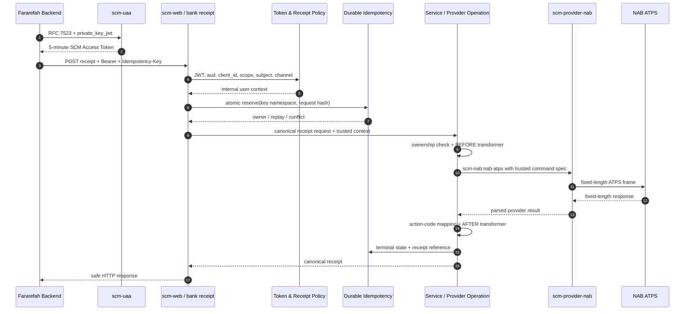
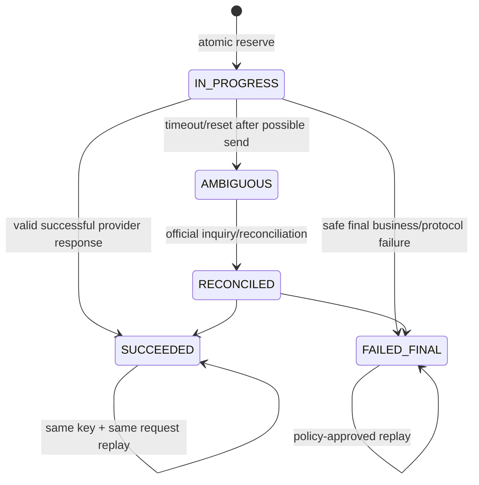

# طراحی سرویس تولید رسید بانکی با NAB/ATPS

## وضعیت و دامنه

| مورد | مقدار |
|---|---|
| وضعیت | طراحی نهایی در سطح معماری؛ هنوز پیاده‌سازی نشده است |
| تاریخ | ۱۴۰۵/۰۶/۰۴ - 2026-08-26 |
| مصرف‌کننده فاز اول | Backend فرارفاه |
| احراز و مجوز | Access Token صادرشده با Flow RFC 7523 در `scm-uaa` |
| Provider | `scm-provider-nab` با protocol `ATPS` |
| خارج از دامنه | حدس Command Code، layout فیلدها یا Action Codeهای اعلام‌نشده NAB |

طراحی Token در [`../scm-uaa/FARAREFAH_UAA_DESIGN.md`](../scm-uaa/FARAREFAH_UAA_DESIGN.md) و مدل Client در [`../scm-uaa/CLIENT_OAUTH_CAPABILITY_DATA_MODEL_DESIGN.md`](../scm-uaa/CLIENT_OAUTH_CAPABILITY_DATA_MODEL_DESIGN.md) آمده است.

---

## ۱. تصمیم معماری

رسید بانکی یک سرویس SCM است، نه یک endpoint مستقیم روی Driver مربوط به NAB. مسیر اجرایی استاندارد چنین است:

```text
Fararefah
  -> SCM Web Gateway
  -> Service Route
  -> OperationType.PROVIDER
  -> ProviderOperationTypeHandler
  -> scm-nab:nab-atps
  -> scm-provider-nab
  -> NAB / ATPS TCP
```

تقسیم مسئولیت:

| مسئولیت | مالک |
|---|---|
| REST API، route، قرارداد نسخه‌دار و templateهای رسید | `scm-web` |
| orchestration مشترک، authorization، ownership، idempotency و audit | `scm-core` |
| encoding/decoding ثابت‌طول، header، TCP، timeout و validation پروتکل | `scm-provider-nab` |
| صدور Access Token فرارفاه | `scm-uaa` |
| Markdown و OpenAPI سرویس | منابع نسخه‌دار `scm-web` از طریق `scm-docs-starter` |

از `OperationType.ATPS` و component قدیمی `atps:` در `scm-plugin-camel-components` استفاده نمی‌شود. مسیر جدید `OperationType.PROVIDER` و URI برابر `scm-nab:nab-atps` است.

توکن OAuth هرگز به NAB ارسال نمی‌شود. توکن فقط دسترسی فرارفاه به SCM Web را مجاز می‌کند؛ NAB با Credential امن و server-side مربوط به Provider فراخوانی می‌شود.

---

## ۲. پیش‌نیاز قراردادی NAB

در سورس فعلی هیچ specification قطعی برای Command «تولید رسید بانکی» وجود ندارد. موارد زیر باید از سند رسمی و نسخه‌دار NAB/ATPS دریافت و به تأیید دو طرف برسد:

- `command.code` دقیق؛
- `header.serviceCode` دقیق؛
- encoding، ترتیب، نام، type، length، padding و converter تمام فیلدهای request؛
- ترتیب و تعریف فیلدهای response؛
- Action Code موفق، ناموفق، not-found و حالت list؛
- معنای دقیق `rqUid` و امکان یا عدم امکان deduplication با آن؛
- رفتار command در timeout پس از ارسال؛
- مالکیت تراکنش و فیلد لازم برای اثبات آن؛
- طبقه‌بندی داده و masking فیلدهای رسید.

این مقادیر در این سند عمداً placeholder هستند. فعال‌سازی سرویس بدون Golden Sample و قرارداد رسمی provider ممنوع است.

---

## ۳. قرارداد عمومی API

نام و مسیر پیشنهادی نسخه اول:

```http
POST /api/v1/bank-receipts HTTP/1.1
Authorization: Bearer <SCM_ACCESS_TOKEN>
Idempotency-Key: <opaque-unique-value>
X-Correlation-Id: <optional-opaque-value>
Content-Type: application/json
```

درخواست حداقلی پیشنهادی:

```json
{
  "transactionReference": "opaque-bank-reference",
  "transactionDate": "2026-08-26"
}
```

`transactionDate` فقط در صورتی اجباری می‌شود که قرارداد NAB برای رفع ambiguity به آن نیاز داشته باشد.

این ورودی‌ها از Caller پذیرفته نمی‌شوند:

- `command`، `protocol` یا `serviceCode`؛
- `provider` یا Provider URI؛
- `rqUid`؛
- Credentialهای NAB؛
- request/response field specification؛
- SCM user ID، `client_id`، channel یا Scope؛
- national code، account یا PAN مگر آن‌که قرارداد رسمی و ownership policy صریحاً نیاز داشته باشد.

همه مقادیر امنیتی از Token، Mapping داخلی و Configuration trusted ساخته می‌شوند.

### پاسخ canonical پیشنهادی

```json
{
  "receiptId": "opaque-scm-receipt-id",
  "transactionReference": "reference",
  "status": "SUCCESS",
  "transactionDateTime": "2026-08-26T10:30:00+03:30",
  "amount": {
    "value": "1000000",
    "currency": "IRR"
  },
  "source": {
    "maskedAccount": "****1234"
  },
  "destination": {
    "maskedAccount": "****9876"
  },
  "description": "safe-description",
  "generatedAt": "2026-08-26T10:31:00+03:30"
}
```

این فقط shape canonical است؛ فیلدهای نهایی باید با Product، Security و قرارداد NAB تصویب شوند. PAN، حساب، شبا و شناسه شخصی فقط به‌شکل mask/tokenized و در حد نیاز نمایش داده می‌شوند.

پاسخ موفق می‌تواند `201 Created` باشد؛ replay همان Idempotency Key همان status/body مصوب را برمی‌گرداند و Provider را دوباره فراخوانی نمی‌کند.

### PDF

اگر «رسید» الزاماً فایل PDF است، rendering یک capability جدا بعد از تولید مدل canonical خواهد بود. `scm-provider-nab` فقط داده رسید را بازمی‌گرداند و مسئول HTML/PDF، فونت، امضا یا نگهداری فایل نیست.

---

## ۴. قرارداد Access Token

فرارفاه ابتدا از Flow تعریف‌شده در RFC 7523 Token می‌گیرد و سپس آن را در Header سرویس رسید ارسال می‌کند:

```text
grant_type = urn:ietf:params:oauth:grant-type:jwt-bearer
client authentication = private_key_jwt
requested scope = bank-receipt.generate
```

SCM Web پیش از ورود درخواست به Service Route حداقل این موارد را کنترل می‌کند:

| کنترل | قاعده |
|---|---|
| Signature | کلید معتبر UAA |
| `iss` | canonical SCM-UAA issuer |
| `aud` | audience اختصاصی SCM Web/Receipt API |
| `exp`، `nbf`، `iat` | معتبر با skew مصوب |
| `sub` | شناسه User داخلی SCM |
| `jti` | موجود و مطابق Token profile |
| `client_id` | دقیقاً `fararefah` در فاز اول |
| Actor | `act.sub=fararefah` |
| Scope | شامل `bank-receipt.generate` |
| User/Binding | فعال و مجاز برای Channel مربوطه |

در فاز بعدی DPoP، همین Grant باقی می‌ماند و Resource Server علاوه بر Token، DPoP Proof و `ath`/`htm`/`htu`/`cnf.jkt` را بررسی می‌کند.

### مانع امنیتی فعلی

`SecurityConfig` موجود در `scm-web` مسیرهای API را `permitAll` می‌کند و به‌علت وجود همین `SecurityFilterChain`، auto-configuration مربوط به Resource Server می‌تواند back off کند. همچنین audience در تنظیمات فعلی الزام صریح ندارد.

بنابراین Go-live منوط به این طراحی امنیتی است:

1. API chain به‌صورت stateless و با JWT Resource Server فعال شود؛
2. route رسید `authenticated` باشد؛
3. issuer و audience exact validation داشته باشند؛
4. `scope` و `client_id` وارد business security context امن شوند؛
5. Policy route علاوه بر Role، `client_id`، Scope و channel binding را کنترل کند؛
6. Headerهای قابل جعل، منبع نهایی Channel یا User نباشند.

اتکا به plugin احراز هویت درون route به‌تنهایی، جایگزین کنترل Resource Server در مرز HTTP نیست. route-level authorization لایه دوم Policy است.

---

## ۵. Flow انتها به انتها



### ترتیب اجباری

1. محدودیت اندازه، Content-Type و syntax درخواست؛
2. JWT validation در HTTP boundary؛
3. authorization بر اساس Client، User، Scope، Audience و Channel؛
4. validation داده کسب‌وکاری؛
5. ownership check اولیه در صورت وجود منبع داخلی؛
6. reserve اتمیک Idempotency؛
7. ساخت payload جدید Provider از allowlist؛
8. فراخوانی دقیقاً یک‌بار NAB تا وقتی نتیجه نامشخص نشده است؛
9. validation پروتکل و Action Code؛
10. ownership check نتیجه در صورت نیاز؛
11. ساخت مدل canonical، masking و persistence؛
12. terminal Audit و پاسخ امن.

درخواست غیرمجاز نباید رکورد Idempotency قابل‌استفاده ایجاد کند یا به Provider برسد.

---

## ۶. مدل Runtime در SCM

این قابلیت با مدل داینامیک موجود ساخته می‌شود و Controller اختصاصی فقط در صورت نبود capability لازم در Gateway توجیه دارد.

### اجزای منطقی

| موجودیت | مقدار پیشنهادی |
|---|---|
| Operation Provider | code=`nab-atps`، URI=`scm-nab:nab-atps`، active |
| Operation | name=`BANK_RECEIPT_NAB`، type=`PROVIDER` |
| BEFORE Definition | ساخت envelope امن NAB از request + trusted context |
| AFTER Definition | کنترل status/action code و ساخت receipt canonical |
| Service | code=`BANK_RECEIPT_GENERATE`، routing=`FIRST` |
| Service Operation | اتصال Service به Operation فوق |
| Channel Service Access | فقط Channel ثبت‌شده فرارفاه |
| INBOUND Definition | `POST /api/v1/bank-receipts` |
| API_DOC Definition | اتصال Markdown/OpenAPI نسخه `v1` |

این نام‌ها canonical پیشنهادی‌اند و باید با naming registry پروژه نهایی شوند؛ Command Code مربوط به NAB از این نام‌ها مشتق نمی‌شود.

### Transform ورودی

BEFORE transformer باید **یک object جدید** بسازد و body خارجی را pass-through نکند:

```json
{
  "command": {
    "code": "<NAB_APPROVED_COMMAND_CODE>",
    "protocol": "ATPS"
  },
  "header": {
    "serviceCode": "<TRUSTED_CONFIG_VALUE>",
    "rqUid": "<SERVER_GENERATED_OR_PERSISTED_VALUE>"
  },
  "data": {
    "<officialField>": "<allowlisted-mapped-value>"
  },
  "request": {
    "fields": ["<official-fixed-length-definitions>"]
  },
  "response": {
    "status": {
      "field": "<official-status-field>",
      "successCode": "<official-success-code>"
    },
    "fields": ["<official-fixed-length-definitions>"]
  }
}
```

`command`، schema فیلدها و Credentialها فقط از artifact/config trusted می‌آیند.

### Header override

Provider فعلی امکان override بعضی Headerها مانند `userId`، `password` و `rqUid` از payload را دارد. برای این سرویس:

- payload خارجی مستقیم وارد Provider نمی‌شود؛
- Credentialها فقط از config/secret store خوانده می‌شوند؛
- `rqUid` را SCM تولید و با Idempotency record مرتبط می‌کند؛
- در پیاده‌سازی Provider، Policy صریح `allow-header-overrides=false` برای Production پیش‌بینی می‌شود.

---

## ۷. Ownership و جلوگیری از دسترسی بین کاربران

Trusted بودن فرارفاه به معنی اجازه مشاهده رسید همه کاربران نیست.

Policy مالکیت:

- User از `sub` نگاشت‌شده در Token به‌دست می‌آید، نه body؛
- اگر transaction reference در SCM قابل resolve است، ownership پیش از NAB کنترل می‌شود؛
- اگر فقط NAB منبع قطعی است، request با context مشتق‌شده از User محدود و پاسخ با User داخلی تطبیق داده می‌شود؛
- اگر command به Account نیاز دارد، Account پیش از ارسال باید برای User authorize شود؛
- در mismatch مالکیت، وجود یا عدم وجود تراکنش به Caller افشا نمی‌شود؛ پاسخ یکسان و مصوب مانند `404` برمی‌گردد؛
- `applyAccountAuthorization` موجود تا زمانی که enforcement Runtime آن اثبات نشده، کنترل امنیتی محسوب نمی‌شود.

منبع قطعی ownership یکی از تصمیم‌های Go-live است و نمی‌تواند به Header channel ورودی واگذار شود.

---

## ۸. Idempotency و وضعیت تراکنش

`X-Correlation-Id` و `Idempotency-Key` دو مفهوم مستقل‌اند. Correlation برای ردیابی و Idempotency برای جلوگیری از اجرای مجدد Command است.

### کلید داخلی

مقدار خام Idempotency Key ذخیره یا log نمی‌شود:

```text
internal key = HMAC(
    client_id | internal_subject | service_code | api_version | idempotency_key
)
```

Request body نیز پس از canonicalization hash می‌شود.

### State machine



رفتار:

- همان key و همان request پس از موفقیت: همان پاسخ/reference، بدون NAB call؛
- همان key با request متفاوت: `409 Conflict`؛
- درخواست concurrent: فقط مالک reserve Provider را صدا می‌زند؛
- timeout بعد از احتمال ارسال: `AMBIGUOUS` و retry خودکار ممنوع؛
- retry فقط وقتی مجاز است که قرارداد رسمی NAB idempotency یا inquiry قابل اتکا تعریف کند؛
- `rqUid` فقط با تضمین رسمی NAB برای deduplication تکرار می‌شود.

### Persistence منطقی

یک Store پایدار با اطلاعات حداقلی لازم است:

| فیلد | توضیح |
|---|---|
| internal key digest | Unique namespace key |
| request fingerprint | تشخیص استفاده مجدد با payload متفاوت |
| client ID و subject digest | namespace و Audit، بدون PII خام |
| service/API version | جلوگیری از collision نسخه‌ها |
| state | `IN_PROGRESS`، `SUCCEEDED`، `FAILED_FINAL`، `AMBIGUOUS` |
| provider `rqUid` | فقط طبق طبقه‌بندی امنیتی |
| receipt/reference ID | برای replay پاسخ |
| safe HTTP status/error category | بدون raw provider error |
| timestamps/expiry/version | TTL، reconciliation و optimistic locking |

Durable DB پیش‌فرض پیشنهادی است؛ cache-only فقط با پذیرش رسمی ریسک از دست‌رفتن state در restart/failover مجاز است. Retention و encryption طبق طبقه‌بندی داده بانکی تعیین می‌شود.

---

## ۹. پاسخ Provider و مدیریت خطا

Parser فعلی NAB ممکن است نتیجه ناموفق کسب‌وکاری را به‌شکل `status.success=false` برگرداند و لزوماً exception ایجاد نکند. AFTER transformer موظف است پیش از ثبت `SUCCEEDED`، status و Action Code را بررسی کند.

Action Codeها باید در Catalog خطای SCM ثبت و به `SCMFault` یا `application/problem+json` امن تبدیل شوند. fallback با `RuntimeException` یا نمایش raw message قابل قبول نیست.

| HTTP | کاربرد |
|---:|---|
| `400` | syntax/validation نامعتبر |
| `401` | Token نامعتبر یا منقضی |
| `403` | Client، Scope، Audience یا Channel غیرمجاز |
| `404` | receipt/transaction موجود نیست یا متعلق به User نیست |
| `409` | تعارض Idempotency Key و request |
| `422` | رد قطعی کسب‌وکاری، در صورت تصویب قرارداد عمومی |
| `429` | rate limit |
| `502` | frame یا پاسخ نامعتبر Provider |
| `503` | NAB یا Provider unavailable |
| `504` | timeout؛ نتیجه با state امن و احتمال `AMBIGUOUS` |

در timeout مشخص نیست Command در NAB اجرا شده یا نه؛ پاسخ نباید Caller را به retry کور تشویق کند. status/error body باید امکان inquiry/reconciliation مصوب را نشان دهد.

Rate limiter این سرویس باید mandatory باشد و readiness نبود implementation لازم را failure اعلام کند؛ fallback ناخواسته به noop برای Production مجاز نیست.

---

## ۱۰. امنیت داده

- TLS روی مرز فرارفاه و SCM و همچنین کانال مورد تأیید به NAB الزامی است.
- Token، Assertion، Authorization Header، Secret و Credential NAB در body، DB business، Log، Trace یا Audit ذخیره نمی‌شوند.
- command/spec/provider URI از Caller قابل انتخاب نیست.
- ورودی‌ها دارای max length، character allowlist و canonicalization هستند.
- response فقط allowlist فیلدهای canonical را برمی‌گرداند.
- Account/PAN/IBAN mask و داده ذخیره‌شده بر اساس classification encrypt/tokenize می‌شود.
- نمونه‌های OpenAPI فقط داده ساختگی و غیرقابل‌انتساب دارند.
- Keyهای HMAC و encryption در secret manager نگهداری و rotation می‌شوند.
- خطاها وجود User، Transaction، Account یا topology NAB را افشا نمی‌کنند.

---

## ۱۱. Observability و Audit

ساختار Trace استاندارد پروژه حفظ می‌شود:

```text
gateway.receive
  -> service.execute
     -> operation.call
        + provider.request event
        + provider.response event
```

رویدادهای Audit مستقل:

```text
RECEIPT_REQUESTED
RECEIPT_COMPLETED
RECEIPT_REPLAYED
RECEIPT_DENIED
RECEIPT_FAILED
RECEIPT_AMBIGUOUS
RECEIPT_RECONCILED
```

Audit فقط شامل Client ID، subject pseudonymous، service/operation code، digest Idempotency، correlation/trace ID، outcome و error category امن است. مبلغ، Account، PAN، national code، body و raw NAB frame ثبت نمی‌شوند.

طبق معماری root پروژه:

- Trace/Log/Audit به NDJSON و سپس Filebeat/Elasticsearch/Kibana می‌روند؛
- Audit از Application Log جدا است؛
- Metric فقط از Actuator/Micrometer به Prometheus/Grafana می‌رود و به فایل نوشته نمی‌شود؛
- tagهای Metric کم‌تنوع‌اند و transaction/user/idempotency در tag قرار نمی‌گیرند.

Metricهای پیشنهادی:

```text
scm.receipt.requests{outcome}
scm.receipt.duration{outcome}
scm.receipt.idempotency{result}
scm.receipt.ambiguous.total
scm.provider.calls{provider,command,outcome}
scm.provider.duration{provider,command,outcome}
```

---

## ۱۲. تست‌های پذیرش

### Contract و Codec

- Golden bytes دقیق request/response با encoding رسمی؛
- ترتیب، length، padding و converter تمام فیلدها؛
- رد override برای command/protocol/Credential/spec/rqUid؛
- decode، masking و Action Code mapping.

### Fake TCP integration

- ACK موفق و ناموفق؛
- success و business failure؛
- frame کوتاه/خراب، connection reset و timeout؛
- list response در صورت وجود در قرارداد؛
- اثبات یک connection و نبود retry کور.

### Security end-to-end

- Token حاصل از RFC 7523 تا Fake NAB؛
- signature، issuer، audience، expiry یا JTI نامعتبر؛
- Client اشتباه، Scope مفقود و spoofed channel؛
- دسترسی به Transaction کاربر دیگر؛
- عدم امکان override User/Client از body؛
- DPoP مثبت/منفی وقتی Feature فعال شد.

### Idempotency

- ۲۰ درخواست concurrent با یک key و request فقط یک NAB call؛
- replay موفق بدون Provider call؛
- همان key با body متفاوت برابر `409`؛
- namespace جدا برای Client/User/API version؛
- restart، expiry و حالت `AMBIGUOUS`؛
- reconciliation مطابق قرارداد رسمی.

### Error و Observability

- تمام Action Codeهای رسمی و unknown fallback امن؛
- HTTP status و SCM error contract صحیح؛
- عدم نشت exception یا raw response؛
- دقیقاً یک terminal Audit؛
- ساختار سه‌سطحی Trace و دقیقاً دو Provider event؛
- نبود Token، PII، Account، PAN، amount و body در Log/Trace/Audit؛
- Metric tagهای کم‌تنوع.

---

## ۱۳. ترتیب Rollout

1. دریافت و امضای قرارداد رسمی Command NAB و Golden Samples؛
2. نهایی‌کردن قرارداد عمومی API، ownership و data classification؛
3. آماده‌سازی JWT Resource Server و Claim compatibility در SCM Web؛
4. فعال‌کردن audience، Scope و Client/Channel policy؛
5. ساخت Idempotency Store و state machine؛
6. تعریف Provider/Operation/Service/Channel route به‌صورت غیرفعال؛
7. Contract test و Fake TCP end-to-end؛
8. انتشار MD/OpenAPI نسخه‌دار؛
9. Pilot با allowlist، rate limit و Dashboard؛
10. فعال‌سازی Service و تمرین rollback/reconciliation.

Rollback با غیرفعال‌کردن Channel Service Access یا Service انجام می‌شود؛ UAA یا Providerهای دیگر متوقف نمی‌شوند. رکوردهای Idempotency و Audit برای reconciliation حفظ می‌شوند.

---

## ۱۴. تصمیم‌های باز و مانع Go-live

| تصمیم | مالک تصمیم |
|---|---|
| Command Code، field layout و Action Code رسمی | NAB/ATPS owner |
| JSON در برابر PDF/printable receipt | Product/Business |
| منبع قطعی ownership تراکنش | Security + Business + Data owner |
| retry/deduplication معنایی `rqUid` | NAB/ATPS owner |
| TTL و retention Idempotency/Receipt | Risk + Operations |
| audience و Scope نهایی | UAA + Web Security |
| binding قطعی `client_id=fararefah` به Channel | Channel Governance |
| masking و فیلدهای پاسخ | Data Classification + Product |

تا بسته‌شدن این موارد، سند در سطح معماری نهایی است اما قرارداد اجرایی NAB نهایی تلقی نمی‌شود.

---

## ۱۵. معیار Go-live

- Token RFC 7523 فقط با audience، Scope، Client و User صحیح پذیرفته شود.
- HTTP security chain واقعاً JWT را validate کند و API رسید `permitAll` نباشد.
- payload خارجی نتواند command، header، credential یا spec NAB را override کند.
- مالکیت تراکنش در Runtime enforce و تست شود.
- Golden frameهای NAB byte-for-byte پاس شوند.
- timeout مبهم retry کور ایجاد نکند.
- Idempotency در چند Pod و پس از restart پایدار باشد.
- همه Action Codeها mapping و fallback امن داشته باشند.
- هیچ داده حساس در Trace/Log/Audit/Metric نشت نکند.
- مستندات MD/OpenAPI نسخه‌دار و کنترل‌شده در دسترس باشند.
